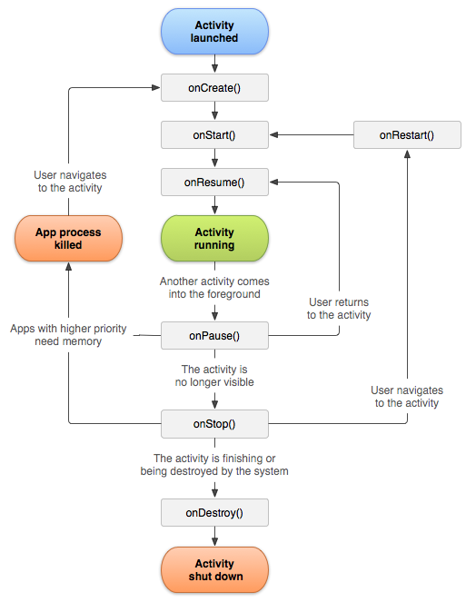
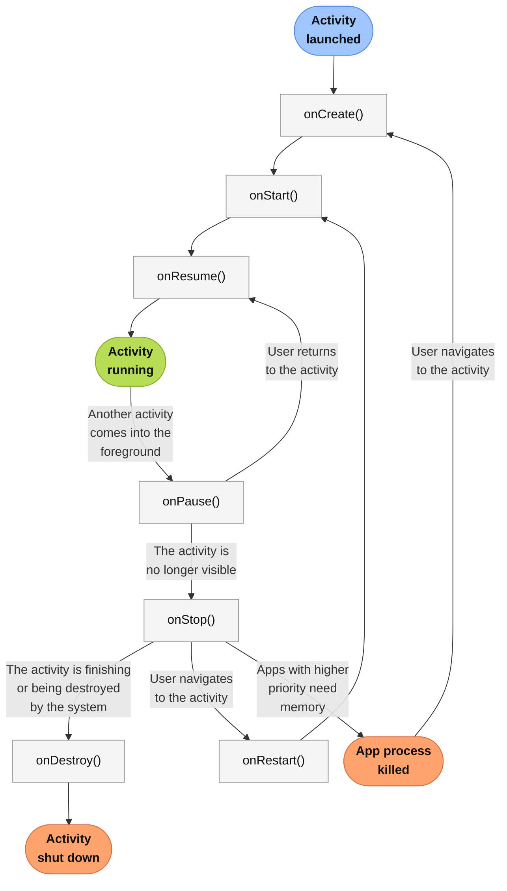
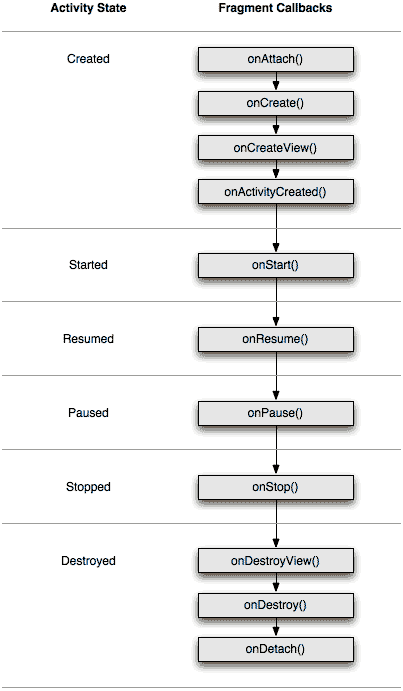

# Activity, Fragment & Lifecycle

Lifecycle in Android describes how components are created, become visible, move to the background, are destroyed and restore state.

## Activity and Fragment

### Activity lifecycle

The same lifecycle can be represented as a maintainable diagram:

`Activity` lifecycle describes how a screen moves through creation, visibility, user interaction, backgrounding and destruction.

The basic callback sequence is `onCreate()` -> `onStart()` -> `onResume()` -> `onPause()` -> `onStop()` -> `onDestroy()`. When returning between `onStop()` and `onStart()`, `onRestart()` may be called.

`onCreate()` is called when the `Activity` is first created: this is where UI, dependency entry points, `ViewModel` and initial setup are usually configured. `onStart()` means the `Activity` becomes visible. `onResume()` means the `Activity` is in the foreground and the user can interact with it.

`onPause()` is called when the `Activity` loses focus, but may still be partially visible. `onStop()` is called when the `Activity` is no longer visible. `onDestroy()` is called before final `Activity` destruction, but it must not be the only place where important data is saved.

On a configuration change, the old `Activity` is destroyed and a new one is created. Therefore, UI state should be stored in `ViewModel`, `savedInstanceState` / `SavedStateHandle` or persistent storage depending on the data type.

### Fragment lifecycle

`Fragment` has its own lifecycle and a separate lifecycle for its `View`. This matters: the `Fragment` object may still exist while its `View` has already been destroyed.

A typical callback sequence is `onAttach()` -> `onCreate()` -> `onCreateView()` -> `onViewCreated()` -> `onStart()` -> `onResume()` -> `onPause()` -> `onStop()` -> `onDestroyView()` -> `onDestroy()` -> `onDetach()`.

The main rule: subscriptions and UI work tied to the `View` should live from `viewLifecycleOwner`, not from the `Fragment` itself. Otherwise it is easy to get a memory leak or a callback into a destroyed `View`.

`onDestroyView()` is where `ViewBinding` and UI references are cleared. `onDestroy()` belongs to the `Fragment` as an object, not necessarily to its `View`.

### Application lifecycle

`Application` is created once per app process and is usually used to initialize global dependencies, DI, logging, analytics or AndroidX Startup-related infrastructure.

Main callbacks: `onCreate()`, `onConfigurationChanged()`, `onLowMemory()`, `onTrimMemory()`. `onTerminate()` is almost never used in the real Android runtime and is mostly called in an emulator or test environment.

`onCreate()` is called at process startup before the first `Activity` / `Service` / `Receiver` is launched, but a `ContentProvider` may be created very early, even before `Application.onCreate()`. This is why some libraries historically used provider-based auto init.

`onTrimMemory(level)` tells the app that the system needs to free memory. For example, `TRIM_MEMORY_UI_HIDDEN` means the UI has moved to the background and UI-related resources can be released.

### Which of `onStop()` or `onDestroy()` may not be called?

If the app process is killed by the system in the background, an `Activity` may not receive the normal full set of final callbacks. In particular, `onDestroy()` is not guaranteed as a place to save critical data.

Reliable save logic should happen earlier: in a lifecycle-aware state holder, repository, database/cache or through `onSaveInstanceState()` for small transient UI state.

`onStop()` is usually called when the `Activity` fully stops being visible, but under hard process termination, architecture must not assume that any callback will definitely have time to run.

**Key idea:** lifecycle callbacks help release resources and synchronize UI, but process death is a separate scenario, so critical data must not be saved only in `onDestroy()`.

## Configuration changes

### Screen rotation

Screen rotation usually causes a configuration change: the current `Activity` is destroyed and recreated for the new configuration.

A typical sequence for the old `Activity`: `onPause()` -> `onStop()` -> `onSaveInstanceState()` -> `onDestroy()`. Then a new `Activity` is created: `onCreate()` -> `onStart()` -> `onRestoreInstanceState()` -> `onResume()`.

`ViewModel` survives a normal configuration change because it is tied to `ViewModelStoreOwner`, not to a specific `Activity` instance. But `ViewModel` does not survive process death: recovery after process death requires `savedInstanceState`, `SavedStateHandle`, database/cache or another persistent storage.

`onSaveInstanceState()` is suitable for small UI state, such as selected tab, scroll position or text input. Do not put large objects, bitmaps or data that can be loaded again into it.

`android:configChanges` can prevent `Activity` recreation for selected configuration changes, but then responsibility for handling those changes manually moves to the app. It is a tool for special cases, not a universal way to "fix" rotation.

### How does `ViewModel` survive screen rotation?

`ViewModel` survives screen rotation because it is stored not inside a specific `Activity` / `Fragment` instance, but in a `ViewModelStore` associated with a `ViewModelStoreOwner`.

During rotation, the old `Activity` is destroyed and a new one is created, but if this is a normal configuration change, the system keeps the `ViewModelStore` and the new `Activity` receives the same `ViewModel` instance through `ViewModelProvider`.

`ViewModel` is suitable for screen state, loaded data and ongoing UI logic that should not be lost when UI is recreated. But `ViewModel` is not persistent storage and does not survive process death.

Recovery after process death requires `SavedStateHandle`, `onSaveInstanceState()`, database, `DataStore`, cache or reloading data from a repository.

**In short:** `ViewModel` survives configuration changes because it is scoped to `ViewModelStoreOwner`, not to a single `Activity` instance, but it does not survive process death.

## Activity launch

### Launch Modes for Activity

Launch mode defines how an `Activity` is created and reused in a task/back stack. It is usually specified in `AndroidManifest.xml` with `android:launchMode`.

`standard` - the default mode: every launch creates a new `Activity` instance and puts it on the back stack. One task can contain several instances of the same `Activity`.

`singleTop` - if the `Activity` is already at the top of the back stack, a new instance is not created and the existing one receives `onNewIntent()`. If it is not at the top, a new instance is created.

`singleTask` - the `Activity` exists as a single instance in its task. If such an instance already exists, the system delivers the `Intent` to it through `onNewIntent()` and clears the activities above it.

`singleInstance` - a stricter version of `singleTask`: the `Activity` is placed in a separate task, and other activities are not added to that task. It is rare in modern Android.

In practice, launch modes should be used carefully: they strongly affect the back stack, deep links, notifications and Back button UX. `standard` works for most screens, while `singleTop` is often useful for screens that can receive a new `Intent` while already on top.

### Intent flags for launching Activity

`FLAG_ACTIVITY_NEW_TASK`, `FLAG_ACTIVITY_SINGLE_TOP` and `FLAG_ACTIVITY_CLEAR_TOP` - intent flags that control `Activity` launch and the back stack at the level of a specific `Intent`.

`FLAG_ACTIVITY_NEW_TASK` launches an `Activity` in a new task or reuses an existing task if it matches by affinity. It is often needed when launching an `Activity` from a non-Activity `Context`.

`FLAG_ACTIVITY_SINGLE_TOP` does not create a new instance if the target `Activity` is already at the top of the current task. Instead, the existing instance receives the new `Intent` through `onNewIntent()`.

`FLAG_ACTIVITY_CLEAR_TOP` looks for an existing `Activity` instance in the current task. If found, all activities above it are removed, and the `Intent` is delivered to that `Activity`. Depending on `launchMode` and flags, the existing instance may receive `onNewIntent()` or be recreated.

**In short:** `launchMode` defines default behavior in the manifest, while intent flags let you override launch behavior for a specific `Intent`.
