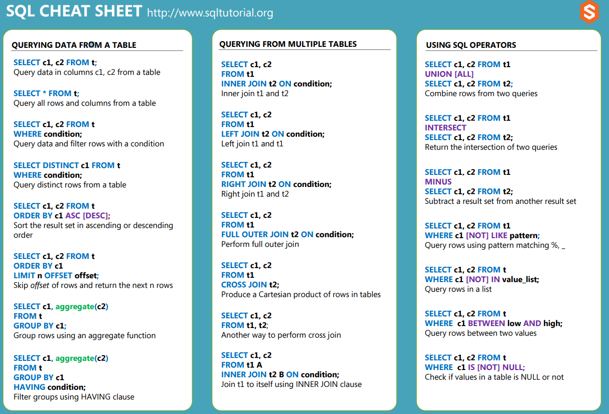

# Storage

Storage в Android включает низкоуровневый SQLite, Room как modern abstraction, DataStore для настроек и legacy `SharedPreferences`.

## SQLite и Room

### SQLiteOpenHelper

`SQLiteOpenHelper` - базовый Android helper для создания, открытия и миграции SQLite database вручную.

Он используется, когда приложение напрямую работает с `SQLiteDatabase` и SQL-запросами: создаёт таблицы, выполняет query/insert/update/delete и управляет версиями схемы.

Класс-наследник обычно задаёт database name и version, а также реализует `onCreate()` и `onUpgrade()`.

**Важно:** сам объект helper создаётся быстро, но база реально открывается только при вызове `getReadableDatabase()` или `getWritableDatabase()`.

В modern Android чаще предпочитают Room, потому что он даёт compile-time проверку SQL, DAO, migrations и меньше boilerplate.

**Коротко:** `SQLiteOpenHelper` is a low-level helper for managing SQLite database creation and migrations; Room is usually preferred for new production code.

### `onCreate()` / `onUpgrade()`

`onCreate()` вызывается, когда database создаётся впервые. Обычно здесь создают tables, indexes, triggers и при необходимости добавляют начальные данные.

`onUpgrade()` вызывается, когда version базы в коде стала больше, чем версия уже существующей базы на устройстве.

Главная задача `onUpgrade()` - аккуратно мигрировать схему и сохранить пользовательские данные. Простой `DROP TABLE` + `CREATE TABLE` допустим только для cache/test data или когда потеря данных осознанно разрешена.

Миграции должны учитывать все старые версии: пользователь может обновиться с версии 1 сразу на версию 5.

**Важно:** после релиза нельзя просто "переписать" уже опубликованный migration step и ожидать, что он повторно выполнится на устройствах, где уже был применён.

**Коротко:** `onCreate()` creates the initial schema, `onUpgrade()` migrates an existing database between versions and must be written carefully to avoid data loss.

### `getReadableDatabase()` / `getWritableDatabase()`

`getReadableDatabase()` и `getWritableDatabase()` возвращают `SQLiteDatabase`, но отличаются намерением открытия.

`getWritableDatabase()` открывает базу для чтения и записи. При первом открытии может вызвать `onCreate()`, `onUpgrade()` и `onOpen()`.

`getReadableDatabase()` обычно возвращает тот же read/write database object, если это возможно. Но если есть проблема, например full disk, он может вернуть read-only database.

Оба метода могут занять много времени, особенно при создании или миграции базы, поэтому их не стоит вызывать на main thread.

После успешного открытия database object кэшируется helper-ом. Обычно не нужно открывать/закрывать базу на каждую маленькую операцию, но нужно закрывать helper/database, когда они больше не нужны.

Для нескольких связанных операций стоит использовать transaction, чтобы сохранить consistency и улучшить performance.

**Коротко:** `getWritableDatabase()` opens a read/write database, `getReadableDatabase()` may return read-only in fallback cases, and both can block during open or migration.

### Room

Room - Jetpack persistence library поверх SQLite, которая даёт более удобный и безопасный API для локальной базы данных.

Основные части Room: `@Entity` описывает таблицу, `@Dao` описывает queries/insert/update/delete, `@Database` связывает entities и DAO в database class.

Room проверяет SQL на этапе компиляции, уменьшает boilerplate и хорошо интегрируется с Kotlin Coroutines и `Flow`.

Room подходит для structured relational data: cache, offline-first data, user-generated content, history, relational entities.

**Важно:** Room всё равно использует SQLite под капотом, поэтому нужно понимать schema design, indexes, transactions и migrations.

По умолчанию Room не позволяет выполнять database operations на main thread, и это хорошо: запросы должны идти через suspend functions, `Flow` или background dispatcher.

**Коротко:** Room is the recommended higher-level abstraction over SQLite for structured local data, with DAO, entities, compile-time SQL checks and migration support.

## Preferences

### DataStore

DataStore - Jetpack API для хранения небольших persistent данных асинхронно и безопаснее, чем `SharedPreferences`.

Есть два основных варианта: Preferences DataStore для key-value данных без заранее заданной схемы и Proto DataStore для typed objects через Protocol Buffers.

DataStore использует coroutines и `Flow`, поэтому чтение обычно выглядит как `Flow` настроек, а запись выполняется через suspend `updateData()` / `edit()`.

Он хорошо подходит для user settings, feature flags, onboarding flags, last selected option и других небольших preferences.

DataStore не предназначен для больших relational данных, partial updates сложных структур или referential integrity. Для этого лучше Room.

**Важно:** для одного файла DataStore должен существовать один instance в процессе, обычно через delegate или DI singleton.

**Коротко:** DataStore is a modern asynchronous replacement for `SharedPreferences` for small key-value or typed settings, while Room is better for complex structured data.

### SharedPreferences

`SharedPreferences` - старый Android API для хранения небольшого набора key-value данных в XML-файле.

Он подходит для простых primitives и `String`: flags, небольшие настройки, selected mode, first launch marker.

Для записи есть `apply()` и `commit()`. `apply()` пишет изменения асинхронно и не возвращает результат, `commit()` пишет синхронно и возвращает boolean success.

`commit()` может блокировать вызывающий thread, поэтому его не стоит использовать на main thread без необходимости.

`SharedPreferences` не предназначен для больших данных, списков сложных объектов, relational data или частых конкурентных записей.

`SharedPreferences` не шифрует данные сам по себе. Для чувствительных данных нужен отдельный secure storage подход, а не обычный preferences file.

В modern Android для новых настроек чаще выбирают DataStore, но `SharedPreferences` всё ещё часто встречается в legacy-коде.

**Коротко:** `SharedPreferences` is a simple legacy key-value storage API; use it for small preferences, prefer DataStore for modern asynchronous settings storage.
