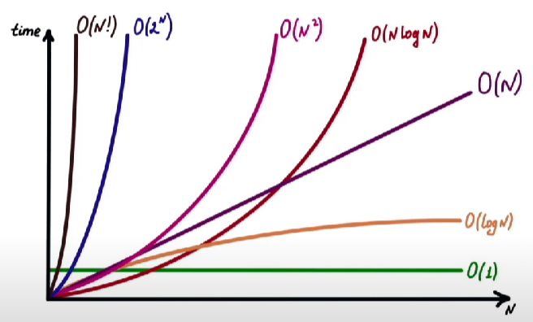

# Algorithms & Complexity

Algorithmic complexity helps estimate how code scales as input data grows. This matters not only for algorithm tasks, but also for regular collections, search, sorting and list processing in an application.

## Big O

Big O is a way to describe how an algorithm's execution time or memory usage grows as input size increases.

It is not exact time in milliseconds, but a scalability estimate. For example, `O(n)` means work grows roughly linearly with input size.

Big O usually describes an upper bound on growth and ignores details that do not change the overall order of complexity. For example, `O(2n)`, `O(n + 10)` and `O(100n)` are usually simplified to `O(n)`, because for large inputs the growth pattern matters more than the exact coefficient.

Understand time complexity and space complexity separately: an algorithm can be fast in time but require a lot of additional memory.

### `O(1)`, `O(n)`, `O(log n)`, `O(n log n)`

`O(1)` is constant complexity: the operation does not depend on input size. Example: array access by index.

`O(n)` is linear complexity: the input needs to be traversed once. Example: finding an element in an unsorted array.

`O(log n)` is logarithmic complexity: at each step, the search space decreases, for example **binary search**.

`O(n log n)` often appears in efficient sorting algorithms such as **merge sort** and average-case **quicksort**.

`O(n^2)` is quadratic complexity: the amount of work grows roughly as the input size multiplied by itself. Common examples are two nested passes over the same collection or a simple sorting algorithm such as **bubble sort**.

A simple heuristic: one pass over a collection usually gives `O(n)`, a nested loop often gives `O(n^2)`, and halving the search space gives `O(log n)`.

## Search, Sorting and Collections

### Binary search in a sorted array

In a sorted array, **binary search** can be used with `O(log n)` complexity.

The idea: compare the target value with the middle of the array and discard half of the range. This is much faster than linear search `O(n)` on large data.

But if the array is not sorted, **binary search** cannot be used without sorting first. Classic **binary search** works well for arrays or `ArrayList`, because access to the middle by index costs `O(1)`. For `LinkedList`, it is usually not useful: moving to the middle of the list already requires traversing nodes.

### Sorting: Bubble sort, Insertion sort, Merge sort and Quicksort

Popular sorting algorithms: **bubble sort**, **insertion sort**, **merge sort**, **quicksort**.

| Algorithm | Average case | Worst case | Details |
| --- | --- | --- | --- |
| **Bubble sort** | `O(n^2)` | `O(n^2)` | Simple educational sorting algorithm, almost never used in real code. |
| **Insertion sort** | `O(n^2)` | `O(n^2)` | Can be efficient for small or nearly sorted data. |
| **Merge sort** | `O(n log n)` | `O(n log n)` | Predictable complexity, but usually requires additional `O(n)` memory. |
| **Quicksort** | `O(n log n)` | `O(n^2)` | Fast in practice, but depends on pivot selection and implementation. |

**Quicksort** runs in `O(n log n)` on average, but in the worst case can degrade to `O(n^2)` if the pivot is chosen poorly. In practice, good implementations use random pivot, median-of-three or hybrid approaches.

**Important:** for **quicksort**, remember both average case and worst case. **Quicksort** is usually fast in practice and often works in-place, but the worst case still exists.

### Collections: `ArrayList`, `LinkedList`, `HashMap` and `HashSet` complexity

**`ArrayList`** gives `O(1)` access by index and usually `O(1)` append to the end, but when the internal array grows, append can become `O(n)`. Insert or remove in the middle costs `O(n)` because elements need to be shifted.

**`LinkedList`** gives `O(1)` insert or remove if the node is already known, but finding the required element is usually `O(n)`. In real Android/Java code, **`LinkedList`** often loses to **`ArrayList`** because of poor cache locality.

**`HashMap`** gives `O(1)` on average for `put()` / `get()` / `remove()`, but depends on `hashCode()`, `equals()` and key distribution. Degradation is possible in bad cases, so custom keys need correct `equals()` / `hashCode()` implementations.

| Structure | Access | Search | Insert | Remove | Practical note |
| --- | --- | --- | --- | --- | --- |
| `ArrayList` | `O(1)` by index | `O(n)` by value | Usually `O(1)` at the end, `O(n)` in the middle | `O(n)` from the middle | A good default for lists with frequent index-based reads. |
| `LinkedList` | `O(n)` by index | `O(n)` | `O(1)` if the node is already known | `O(1)` if the node is already known | Rarely wins in regular Android/Java code because of search cost and cache locality. |
| `HashMap` | Not indexed | Usually `O(1)` by key | Usually `O(1)` for `put()` | Usually `O(1)` for `remove()` | `hashCode()` and `equals()` quality directly affects performance. |
| `HashSet` | Not indexed | Usually `O(1)` for `contains()` | Usually `O(1)` for `add()` | Usually `O(1)` for `remove()` | Useful when fast membership checks matter. |

### Is HashMap thread-safe?

`HashMap` is not thread-safe. Concurrent reads are safe only when no thread modifies the map; if at least one thread writes, external synchronization or a concurrent collection is required.

Unsafe concurrent access can cause race conditions, lost updates, visibility issues, internal data corruption and `ConcurrentModificationException` during iteration. This is only a short warning for collection complexity; for practical concurrent maps, see [`ConcurrentHashMap`](../java/concurrency.md#concurrenthashmap).

**Key idea:** `ArrayList` is usually better for sequential data and index access, `HashMap` / `HashSet` for fast lookup by key or membership checks, and `LinkedList` should be chosen only when there is a clear reason and the actual operations are known.
