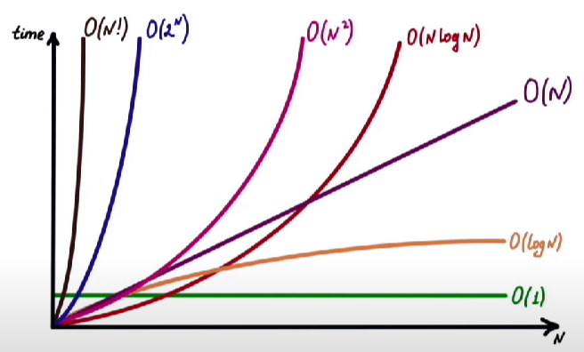

# Algorithms & Complexity

Algorithmic complexity estimates how resource usage grows with input size. It matters in interviews and in application code that searches, sorts, groups or renders growing collections.

## Big O

Big O describes an asymptotic upper bound for time or space growth. It does not predict milliseconds. Constants and lower-order terms are omitted, so `O(2n + 10)` becomes `O(n)`.

Always state what `n` represents and which case is being discussed:

- **Worst case** gives a limit for any valid input of size `n`.
- **Average case** depends on assumptions about input distribution.
- **Amortized cost** spreads occasional expensive operations across a sequence, such as resizing an `ArrayList`.

Time and auxiliary-space complexity are separate. An algorithm may reduce time by building an additional set or map.

### Common growth rates

- `O(1)`: constant work, such as array access by index.
- `O(log n)`: the remaining problem shrinks by a constant factor, as in binary search.
- `O(n)`: one full pass over `n` elements.
- `O(n log n)`: common for efficient comparison sorting.
- `O(n²)`: work over many pairs, such as a simple double comparison loop.
- `O(2ⁿ)` or `O(n!)`: exhaustive combinations or permutations; practical only for small inputs unless pruned.

Count total work rather than loop syntax. Two consecutive `O(n)` loops are `O(n)`, not `O(n²)`. Nested loops may be `O(n²)`, `O(n log n)` or `O(n × m)` depending on their bounds. A loop that repeatedly halves its range is `O(log n)`.

## Search

Linear search over an unsorted list is `O(n)`. Binary search is `O(log n)`, but it requires data sorted with the same ordering used by the search.

Binary search is effective on arrays and random-access lists because reading the middle element is `O(1)`. On a linked list, locating each middle position requires traversal, removing the practical advantage.

Sorting once costs about `O(n log n)`. It may be worthwhile before many searches, but not necessarily before a single lookup. If frequent membership checks are the goal and ordering is unnecessary, building a `HashSet` in `O(n)` often gives expected `O(1)` lookups.

## Sorting

| Algorithm | Best | Average | Worst | Auxiliary space | Practical note |
| --- | --- | --- | --- | --- | --- |
| Bubble sort | `O(n)` with early exit | `O(n²)` | `O(n²)` | `O(1)` | Educational; rarely appropriate in production. |
| Insertion sort | `O(n)` | `O(n²)` | `O(n²)` | `O(1)` | Useful inside hybrid sorts for small or nearly sorted ranges. |
| Merge sort | `O(n log n)` | `O(n log n)` | `O(n log n)` | Usually `O(n)` | Predictable and stable in common implementations. |
| Quicksort | `O(n log n)` | `O(n log n)` | `O(n²)` | `O(log n)` average, `O(n)` worst stack | Fast in-place partitioning; quality depends on pivot and implementation. |

Production sort functions are commonly optimized or hybrid implementations. Prefer the standard library unless the algorithm itself is the task. Check API guarantees when stability, memory or worst-case bounds matter.

## Collection operation costs

The table describes common JVM implementations and typical costs, not every `List` or `Map` implementation.

| Structure | Read / lookup | Insert | Remove | Practical note |
| --- | --- | --- | --- | --- |
| `ArrayList` | `O(1)` by index; `O(n)` by value | Amortized `O(1)` at end; `O(n)` in middle | `O(n)` in middle | Strong default for sequential data and iteration. |
| `LinkedList` | `O(n)` by index or value | `O(1)` at known node or end; otherwise `O(n)` to locate | Same: locating often dominates | Nodes are not exposed by the Java API; poor locality often outweighs theoretical benefits. |
| `ArrayDeque` | `O(1)` at either end | Amortized `O(1)` at either end | `O(1)` at either end | Prefer for stack or queue behavior. |
| `HashMap` | Expected `O(1)` by key | Expected `O(1)` | Expected `O(1)` | Depends on hashing, equality, capacity and key distribution. |
| `HashSet` | Expected `O(1)` membership | Expected `O(1)` | Expected `O(1)` | Useful for uniqueness and membership checks. |

`ArrayList.add()` is amortized `O(1)`: most appends are constant-time, while occasional growth copies the backing array in `O(n)`. A sequence of `n` appends still costs `O(n)` overall.

Hash collections rely on stable, consistent `equals()` and `hashCode()`. Mutating fields used by either function while an object is a key or set element can make it effectively unreachable. Poor distribution increases collisions and degrades performance.

`HashMap` is not thread-safe. Concurrent structural modification requires external synchronization or a concurrent collection; see [`ConcurrentHashMap`](../java/concurrency.md#concurrenthashmap).

## Complexity in Android code

Big O predicts scaling, but two `O(n)` implementations can behave very differently because of allocations, cache locality, boxing, I/O or work performed on the main thread. A small input may not justify a more complex algorithm; a linear operation repeated for every frame may still cause jank.

First identify realistic input sizes and the user-visible bottleneck. Use profiling, Microbenchmark for isolated hot code, and Macrobenchmark for flows such as startup or scrolling. Optimize measured work while keeping correctness and readability.

Related topics: [Collections](../kotlin/collections.md), [Java Core](../java/core.md), [Performance & Memory](../android/performance-memory.md), and [Java Concurrency](../java/concurrency.md).
