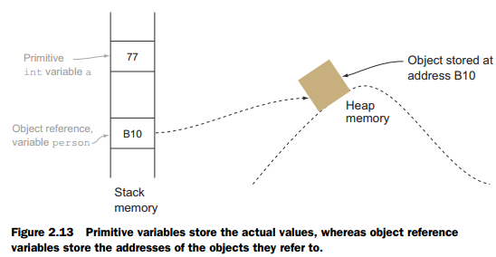

# Memory & Runtime Basics

Memory and runtime basics explain object lifetime, garbage collection, leaks and allocation-related performance problems in Android apps.

## Managed memory on Android

ART manages Java and Kotlin objects in a per-process heap. An app also uses memory outside that heap, including thread stacks, native allocations, code, graphics buffers and memory-mapped files. Garbage collection reclaims managed objects; it does not release every kind of resource or native allocation.

### Stack and heap

Each thread has a call stack containing frames for active calls, including bookkeeping and some local values. Frames are removed when calls return. Deep or infinite recursion can exhaust the stack and cause `StackOverflowError`.

Objects are normally allocated in the managed heap, while a local variable may hold a reference to an object. The stack-versus-heap model is useful, but exact placement is a runtime implementation detail: ART may optimize allocations. If the process cannot satisfy an allocation, it can fail with `OutOfMemoryError` even when some unreachable objects have not yet been reclaimed.

### Reachability and garbage collection

The collector starts from GC roots, such as active threads, static fields and JNI references, and follows reference chains. A managed object becomes eligible for collection when it is no longer reachable, not merely when the application has finished using it. Cycles can be collected if no path from a root reaches them.

A memory leak is therefore usually a lifetime bug: an object is still reachable but no longer useful. Common Android examples include a singleton retaining an `Activity`, a listener that was not removed, or work whose callback outlives its screen. GC timing is not deterministic, and resource cleanup should use lifecycle APIs or `Closeable`, not finalization.

### Strong, soft, weak and phantom references

- A **strong reference** is an ordinary reference and keeps its target reachable.
- A **weak reference** does not keep its target alive. It can help with auxiliary mappings, but it is not a substitute for explicit listener removal or lifecycle ownership.
- A **soft reference** may survive until memory pressure increases. Its clearing policy is not predictable, so Android caches should normally use explicit size limits, such as `LruCache`.
- A **phantom reference** is used with `ReferenceQueue` for low-level post-mortem processing. Application code rarely needs it; `Cleaner` or explicit resource ownership is usually clearer.

Frequent temporary allocations can trigger more GC work and contribute to jank. Measure with Android Studio or Perfetto before optimizing, and inspect retained-reference paths when diagnosing a leak.

## Related topics

- [Performance & Memory](../android/performance-memory.md)
- [JVM / Android Runtime](../java/jvm-android-runtime.md)
