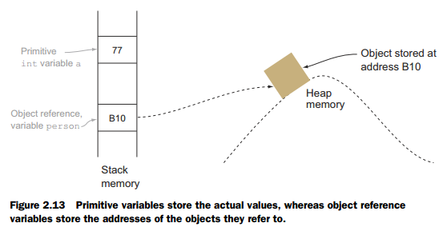

# Memory & Runtime Basics

Базовые понятия памяти и runtime помогают понимать утечки памяти, жизненный цикл объектов, работу GC и поведение Java/Kotlin-кода на Android.

## Память и GC

### Stack vs Heap

Stack - область памяти для call stack, локальных переменных, параметров вызовов и return addresses. Он быстрый и освобождается автоматически при выходе из функции.

Heap - область памяти для объектов, которые могут жить дольше одного вызова функции. За их освобождение отвечает Garbage Collector.

В Java/Kotlin объект обычно создаётся в heap, а локальная переменная может хранить reference на этот объект.

У каждого thread свой stack. Если он переполнен, возникает `StackOverflowError`. Heap общий для объектов, и при нехватке памяти возможен `OutOfMemoryError`.

### Garbage Collection roots

GC roots - стартовые точки, от которых Garbage Collector определяет достижимые объекты.

К GC roots относятся active thread stacks, static fields, JNI references, system class loader references и объекты, удерживаемые monitor lock. Если объект достижим от root, он считается живым и не будет удалён.

Memory leak возникает, когда объект уже не нужен логически, но всё ещё достижим через какую-то цепочку references.

### Strong / Soft / Weak / Phantom references

Strong reference - обычная ссылка. Пока объект достижим через strong reference, GC его не удалит.

Weak reference - ссылка, которая не удерживает объект от сборки мусора. Она полезна для caches, listeners или ситуаций, где нельзя продлевать lifetime объекта.

Soft reference - ссылка, которая может удерживаться дольше и очищаться при нехватке памяти, но в современном Android обычно лучше использовать явные cache policies.

Phantom reference - ссылка для низкоуровневого отслеживания момента, когда объект стал недоступен. Вместе с `ReferenceQueue` позволяет выполнить cleanup ресурсов без `finalize()`. В обычной Android-разработке встречается редко.
