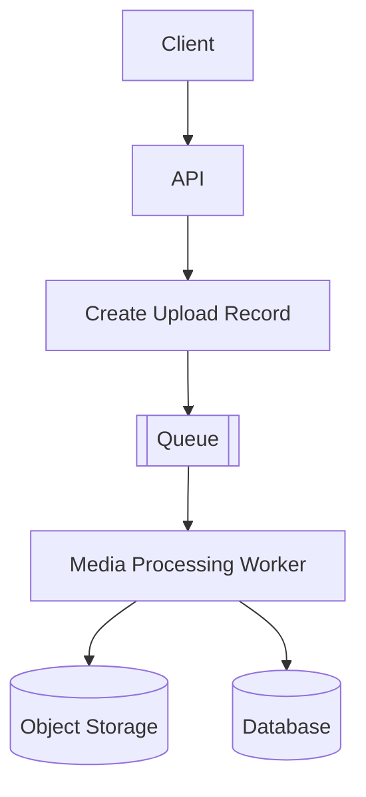
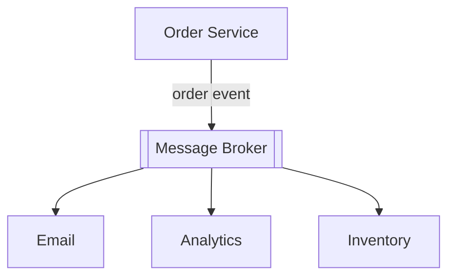

# Async Processing & Messaging

Synchronous request-response is appropriate when the caller needs an immediate result and the work is short enough for the request budget. Asynchronous processing decouples acceptance from completion: the system records intent, returns an accepted or pending state, and performs work later.

## Queues and workers

A queue buffers work between a **producer**, which submits messages, and a **consumer** or **worker**, which processes them. This can absorb bursts, control concurrency, and keep slow or expensive work outside an HTTP request.

The API can return an identifier and `pending` status after durably recording the upload. The client later polls, observes an update, or receives a notification. The trade-off is explicit eventual processing: acceptance no longer means the final result exists.

Queue depth, message age, worker capacity, and failure rate are important operational signals. Backpressure limits producers or worker concurrency when downstream systems cannot keep up.

## Pub/sub and event-driven communication

In publish/subscribe, a producer publishes an event without selecting one worker. Independent subscribers react to it, enabling fan-out:

This reduces direct coupling, but contracts still exist. Event schemas, ownership, versioning, privacy, ordering, and replay behavior need definition. A broker is infrastructure; event-driven design is the communication model.

## Delivery and processing semantics

Delivery can fail before or after processing, and acknowledgement can be lost. Common terms describe intended behavior:

- **At-most-once** may lose work but avoids broker-driven redelivery.
- **At-least-once** retries delivery, so consumers must expect duplicates.
- **Exactly-once** is meaningful only within a precisely stated boundary and set of guarantees. End-to-end side effects often still require idempotency or deduplication.

An idempotent consumer can process the same logical message more than once without applying the business effect twice. Stable message or operation identifiers help record completed work.

Ordering guarantees also need a scope. Global ordering is expensive and often unnecessary; ordering per account, conversation, or partition may be sufficient. Multiple workers and retries can otherwise reorder messages.

## Retries and dead letters

Retry transient failures with bounded attempts, backoff, and jitter. A **DLQ (Dead-Letter Queue)** isolates messages that repeatedly fail so they do not block healthy work. A DLQ is not a resolution by itself: teams need alerts, diagnosis, replay or correction procedures, and retention rules.

Queues do not guarantee that work happens exactly once. Durable enqueueing, consumer idempotency, observability, and recovery procedures together define reliability.

## See also

- [System Design Fundamentals](fundamentals.md)
- [Scalability & Capacity](scalability-capacity.md)
- [Reliability & Failure Handling](reliability.md)
- [System Design Diagrams](diagrams.md)
