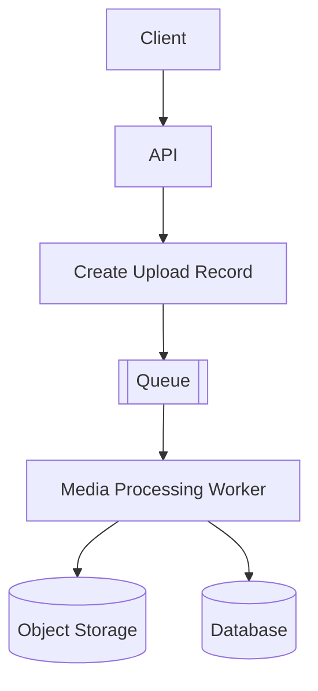
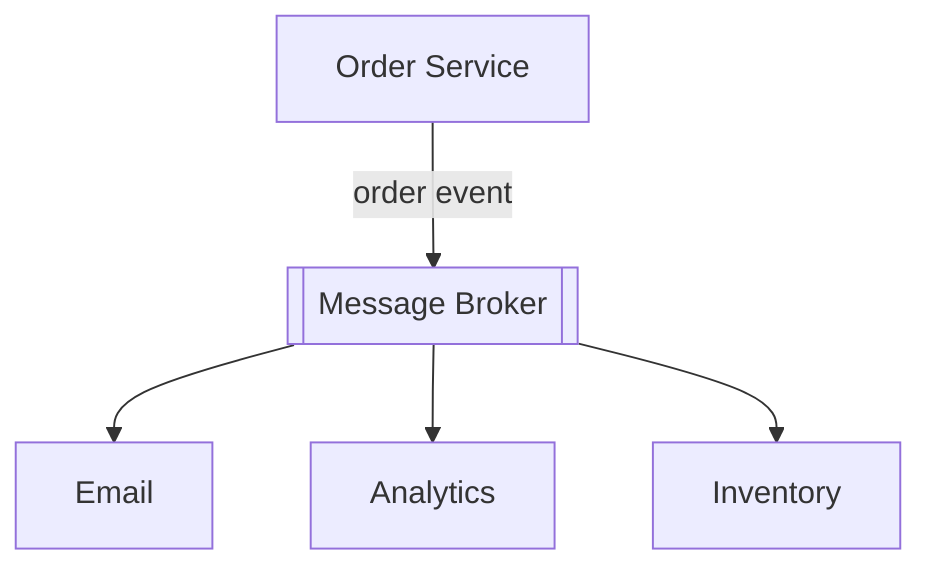

# Async Processing & Messaging

Синхронный request-response подходит, когда вызывающей стороне нужен немедленный результат, а работа укладывается в бюджет запроса. Асинхронная обработка разделяет принятие и завершение: система фиксирует намерение, возвращает состояние `accepted` или `pending`, а работу выполняет позже.

## Очереди и workers

Очередь буферизует работу между **producer**, который отправляет сообщения, и **consumer** или **worker**, который их обрабатывает. Она помогает поглощать всплески, контролировать параллелизм и выносить медленную или дорогую работу из HTTP-запроса.

API может вернуть идентификатор и статус `pending` после надёжной фиксации загрузки. Затем клиент опрашивает статус, наблюдает обновление или получает уведомление. Компромисс состоит в явной eventual processing: принятие запроса ещё не означает готовность результата.

Глубина очереди, возраст сообщения, capacity workers и частота ошибок являются важными эксплуатационными сигналами. Backpressure ограничивает producers или параллелизм workers, когда downstream-системы не справляются.

## Pub/sub и event-driven взаимодействие

В publish/subscribe producer публикует событие, не выбирая конкретного worker. Независимые subscribers реагируют на него, обеспечивая fan-out:

Прямая связанность уменьшается, но контракты остаются. Нужно определить схемы событий, владение, versioning, privacy, ordering и поведение при replay. Broker является инфраструктурой, а event-driven design - моделью взаимодействия.

## Семантика доставки и обработки

Сбой возможен до обработки или после неё, а acknowledgement может потеряться. Распространённые термины описывают ожидаемое поведение:

- **At-most-once** может потерять работу, но не инициирует повторную доставку со стороны broker.
- **At-least-once** повторяет доставку, поэтому consumers должны учитывать duplicates.
- **Exactly-once** имеет смысл только в точно заданной границе и наборе гарантий. Сквозные side effects часто всё равно требуют idempotency или deduplication.

Идемпотентный consumer может обработать одно логическое сообщение несколько раз, не применив бизнес-эффект повторно. Стабильные идентификаторы сообщения или операции помогают фиксировать выполненную работу.

Гарантия ordering также требует области действия. Глобальный порядок дорог и часто не нужен, а порядка в рамках аккаунта, диалога или partition может быть достаточно. Несколько workers и retries иначе способны изменить порядок сообщений.

## Retries и dead letters

Для временных ошибок используйте ограниченное число retries, backoff и jitter. **DLQ (Dead-Letter Queue)** изолирует сообщения, которые постоянно завершаются ошибкой, чтобы они не блокировали исправную работу. DLQ сама по себе не решает проблему: нужны alerts, диагностика, процедура replay или исправления и правила хранения.

Очередь не гарантирует выполнение работы ровно один раз. Надёжная постановка в очередь, идемпотентность consumer, observability и процедуры восстановления вместе определяют надёжность.

## См. также

- [Основы System Design](fundamentals.ru.md)
- [Scalability & Capacity](scalability-capacity.ru.md)
- [Reliability & Failure Handling](reliability.ru.md)
- [System Design Diagrams](diagrams.ru.md)
