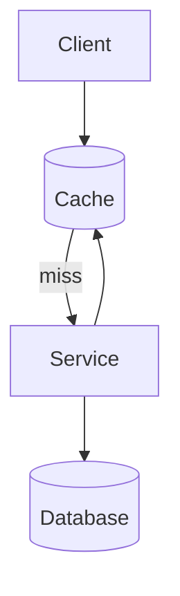

# Caching & Data Freshness

A cache keeps a reusable copy of data closer to a consumer or in a faster medium. It can reduce latency and source load, but every copy creates questions about freshness, invalidation, eviction, and failure behavior. A cache is useful when its access pattern and consistency policy justify that complexity.

## Cache locations and behavior

Caches can exist on the mobile client, in a service, near a database query path, or at a **CDN (Content Delivery Network)** for geographically distributed content. A cache hit serves an entry; a miss falls through to the source of truth.

With **cache-aside**, the application controls the cache:

1. Check the cache.
2. On a miss, read the source of truth.
3. Populate the cache.
4. Return the data.

For writes, one approach invalidates the entry so the next read reloads it. Another updates the cache after the authoritative write. Invalidation reduces the chance of preserving an incorrectly computed value, while updating can improve immediate hit rate. Ordering, concurrent writes, and failed updates determine which is safer for a specific flow.

## Lifetime, eviction, and freshness

**TTL (Time To Live)** limits how long an entry may be reused. A shorter TTL improves expected freshness but increases misses and load. Eviction removes entries because they expire or the cache reaches a resource limit. Cache warming preloads likely entries, but can waste resources or overwhelm dependencies if applied broadly.

Invalidation should follow ownership: the component that authoritatively changes data needs a reliable way to expire or replace affected entries. Even then, races and delivery failures can leave stale data. Define whether stale results are acceptable, for whom, and for how long.

**Stale-while-revalidate** serves an existing value quickly and refreshes it in the background. It is useful when low latency matters more than immediate freshness. **Negative caching** temporarily stores a not-found or failure result to protect a dependency, but its TTL must account for data that may soon appear or recover.

## Failure and load patterns

When a popular entry expires, many callers may reload it simultaneously. This cache stampede, or thundering herd, can overload the source. Request coalescing, jittered expiration, controlled warming, or serving a bounded stale value can reduce the spike.

A cache outage can also increase database load abruptly. Capacity plans should cover degraded operation, and cache keys must avoid accidental hotspots or cross-user data exposure.

## Mobile caches

A client-side cache improves perceived latency and can support offline use, but it is also a replicated view of server data. The design needs explicit rules for refresh, staleness indicators, pending local writes, conflicts, storage limits, and sensitive-data cleanup. The UI should not silently combine unrelated network and local states.

Android-specific choices such as Room, DataStore, and files are covered in [Android Storage](../../android/storage.md). The [offline-first example](offline-first-mobile.md) shows how a local database, synchronization, and pending mutations can work together.

## See also

- [Data Storage & Consistency](data-storage-consistency.md)
- [Scalability & Capacity](scalability-capacity.md)
- [Reliability & Failure Handling](reliability.md)
