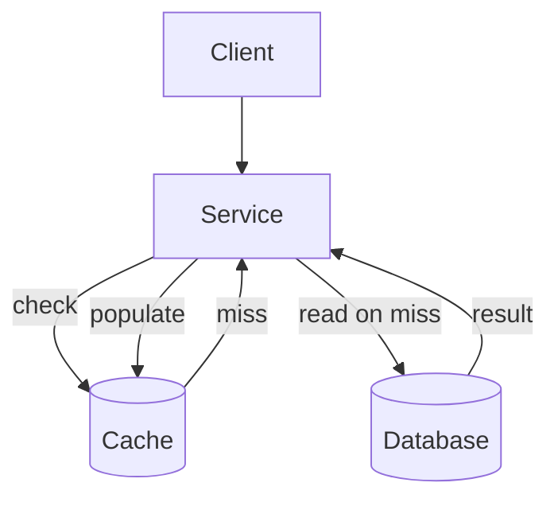

# Caching & Data Freshness

Кэш хранит переиспользуемую копию данных ближе к потребителю или на более быстром носителе. Он может снизить latency и нагрузку на источник, но каждая копия создаёт вопросы о freshness, invalidation, eviction и поведении при сбоях. Кэш полезен, когда access pattern и политика consistency оправдывают эту сложность.

## Расположение и поведение кэша

Кэш может находиться на мобильном клиенте, в сервисе, рядом с путём запроса к базе или в **CDN (Content Delivery Network)** для географически распределённого контента. При cache hit возвращается найденное значение, а при cache miss чтение продолжается из source of truth.

В модели **cache-aside** приложение управляет кэшем:

1. Проверяет кэш.
2. При miss читает source of truth.
3. Заполняет кэш.
4. Возвращает данные.

При записи один подход инвалидирует значение, чтобы следующее чтение загрузило его заново. Другой обновляет кэш после авторитетной записи. Invalidation уменьшает риск сохранить неправильно вычисленное значение, а обновление может повысить немедленный hit rate. Конкретный выбор зависит от порядка операций, параллельных записей и поведения при сбоях.

## Время жизни, eviction и freshness

**TTL (Time To Live)** ограничивает срок переиспользования значения. Короткий TTL повышает ожидаемую freshness, но увеличивает число misses и нагрузку. Eviction удаляет значения из-за истечения срока или нехватки ресурсов. Cache warming заранее загружает вероятно нужные значения, но при слишком широком применении тратит ресурсы или перегружает зависимости.

Политика invalidation должна учитывать владение данными: компонент, который авторитетно их меняет, должен уметь надёжно удалить или заменить связанные записи. Даже тогда races и сбои доставки могут оставить устаревшие данные. Нужно определить, допустимы ли stale results, для кого и как долго.

**Stale-while-revalidate** быстро отдаёт существующее значение и обновляет его в фоне. Подход полезен, когда низкая latency важнее немедленной freshness. **Negative caching** обычно сохраняет известный отрицательный результат, например «ресурс не существует». Временные сетевые и серверные ошибки, а также ошибки авторизации и зависящие от пользователя результаты нельзя кэшировать без явной политики. Если отдельные ошибки всё же кэшируются, TTL должен быть достаточно коротким, чтобы не скрыть восстановление.

## Сбои и всплески нагрузки

Когда популярная запись истекает, множество клиентов могут одновременно начать её загрузку. Такой cache stampede, или thundering herd, способен перегрузить источник. Request coalescing, случайный разброс срока, контролируемый warming или временная выдача устаревшего значения уменьшают всплеск.

Отказ кэша также может резко увеличить нагрузку на базу. Capacity plan должен учитывать degraded mode, а cache keys не должны создавать случайные hotspots или раскрывать данные между пользователями.

## Кэш на мобильном клиенте

Client-side cache улучшает воспринимаемую latency и поддерживает offline-сценарии, но остаётся репликой серверных данных. Дизайну нужны явные правила обновления, индикации устаревания, обработки pending local writes и конфликтов, ограничения хранилища и удаления чувствительных данных. UI не должен незаметно смешивать независимые состояния сети и локального хранилища.

Android-специфичные варианты Room, DataStore и файлов разобраны в [Android Storage](../../android/storage.ru.md). [Пример offline-first приложения](offline-first-mobile.ru.md) показывает совместную работу локальной базы, синхронизации и pending mutations.

## См. также

- [Data Storage & Consistency](data-storage-consistency.ru.md)
- [Scalability & Capacity](scalability-capacity.ru.md)
- [Reliability & Failure Handling](reliability.ru.md)
