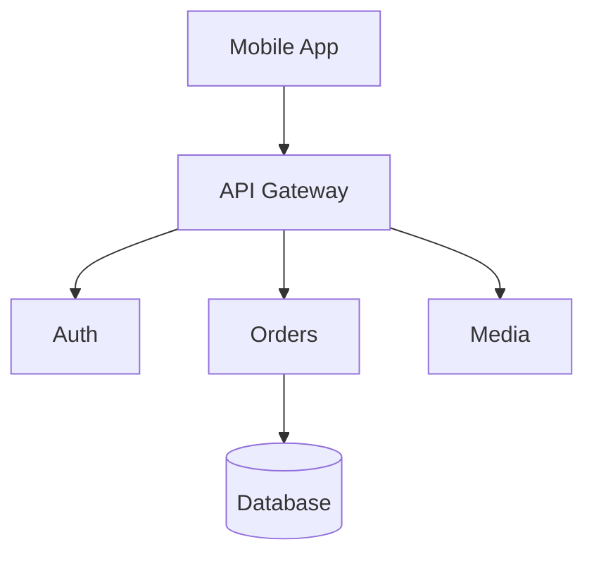
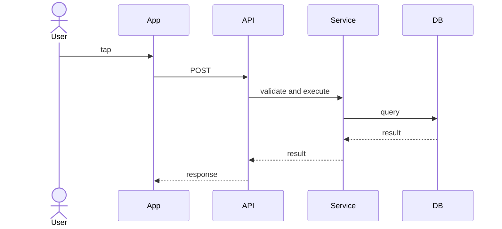
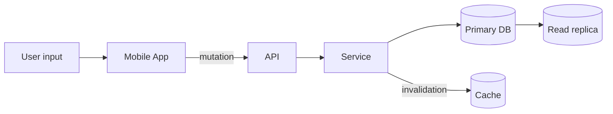

# System Design Diagrams

A useful diagram answers a specific engineering question. It should expose relevant boundaries, data flow, ordering, or ownership without reproducing every class and deployment detail. Use a small set of consistent symbols and add labels where an arrow's meaning is not obvious.

## High-level architecture or component diagram

**Question:** What are the major components, and how do they depend on one another?

Use this view to discuss system boundaries, responsibility, trust zones, synchronous and asynchronous links, and possible bottlenecks. Avoid mixing classes, database tables, cloud resources, and user journeys in one unexplained diagram.

## Sequence diagram

**Question:** In what order do participants interact for one scenario?

Sequence diagrams are especially useful for retries, timeouts, ordering, races, synchronous versus asynchronous boundaries, and partial failures. Include alternate or failure paths when they change the design. Mark when acknowledgement occurs so readers do not confuse accepted work with completed work.

## Data-flow diagram

**Question:** Where does data originate, move, transform, and persist?

Label sources of truth, replicas, sensitive fields, protocols, and trust boundaries when relevant. A data-flow view is useful for freshness, privacy, retention, and reconciliation questions that a component diagram can hide.

## Lightweight C4 model

The C4 model offers zoom levels rather than one enormous diagram:

1. **System context** shows users, the system, and external systems.
2. **Container** shows deployable or runnable parts such as the mobile app, API, worker, and database.
3. **Component** opens one container into its major responsibilities.
4. **Code** describes implementation details and is often better left to code or focused documentation.

For many discussions, context and container views are enough. Use deeper levels only when they answer a current question, and keep names consistent across levels.

## UML where it helps

UML provides standardized notation for sequence, component, class, and state diagrams. Formal notation can reduce ambiguity when the audience shares it, but completeness is not the goal. A state diagram is valuable for a payment or synchronization state machine; a class diagram is less useful for explaining service capacity.

Prefer clarity of communication over formal UML completeness. Give each diagram a title, scope, legend when needed, and a short explanation of the decision it supports. Update or remove diagrams that no longer match the system.

## Review checklist

- Is the system boundary visible?
- Are components named by responsibility rather than technology alone?
- Do arrows state direction and meaning?
- Are source of truth and durable state identifiable?
- Are critical async boundaries, timeouts, or failure paths visible?
- Is the level of detail consistent with the question?

## See also

- [System Design Fundamentals](fundamentals.md)
- [Async Processing & Messaging](async-messaging.md)
- [Reliability & Failure Handling](reliability.md)
- [Offline-First Mobile Application](offline-first-mobile.md)
