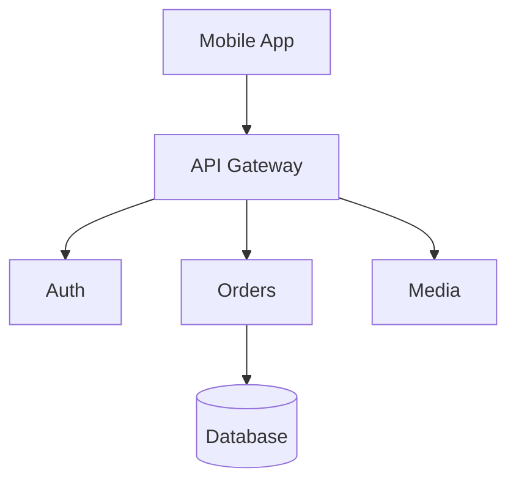
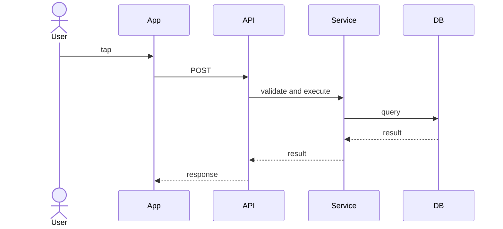
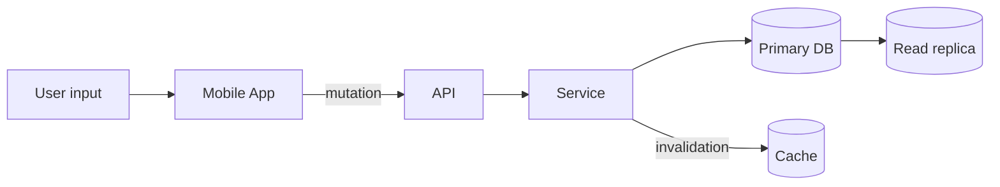

# System Design Diagrams

Полезная диаграмма отвечает на конкретный инженерный вопрос. Она показывает нужные границы, поток данных, порядок или владение, не копируя каждый класс и каждую деталь deployment. Используйте небольшой набор последовательных обозначений и подписывайте стрелки, смысл которых неочевиден.

## Высокоуровневая архитектурная или компонентная диаграмма

**Вопрос:** из каких основных компонентов состоит система и как они зависят друг от друга?

Такое представление помогает обсуждать границы системы, ответственность, trust zones, синхронные и асинхронные связи и возможные bottlenecks. Не смешивайте классы, таблицы базы, cloud resources и пользовательские сценарии в одной схеме без пояснений.

## Sequence diagram

**Вопрос:** в каком порядке участники взаимодействуют в одном сценарии?

Sequence diagrams особенно полезны для анализа retries, timeouts, ordering, races, синхронных и асинхронных границ и частичных отказов. Показывайте альтернативные пути или ошибки, если они меняют дизайн. Отмечайте момент acknowledgement, чтобы принятую работу не путали с завершённой.

## Data-flow diagram

**Вопрос:** где данные возникают, перемещаются, преобразуются и сохраняются?

При необходимости отмечайте sources of truth, replicas, чувствительные поля, протоколы и trust boundaries. Data-flow view полезен для вопросов freshness, privacy, retention и reconciliation, которые может скрыть компонентная диаграмма.

## Облегчённая модель C4

Модель C4 предлагает уровни приближения вместо одной огромной схемы:

1. **System context** показывает пользователей, систему и внешние системы.
2. **Container** показывает запускаемые или развёртываемые части: мобильное приложение, API, worker и базу.
3. **Component** раскрывает основные ответственности одного container.
4. **Code** описывает детали реализации, которые часто лучше оставить коду или точечной документации.

Для многих обсуждений достаточно context и container views. Используйте более глубокие уровни, только если они отвечают на текущий вопрос, и сохраняйте одинаковые названия между уровнями.

## UML там, где он полезен

UML задаёт стандартизированную нотацию для sequence, component, class и state diagrams. Формальные обозначения снижают неоднозначность, если аудитория их знает, но полнота нотации не является целью. State diagram полезна для state machine платежа или синхронизации, а class diagram мало помогает объяснить capacity сервиса.

Приоритетом остаётся ясность коммуникации, а не формальная полнота UML. У каждой диаграммы должны быть название, scope, при необходимости легенда и короткое объяснение решения, которое она поддерживает. Устаревшие схемы следует обновлять или удалять.

## Чек-лист проверки

- Видна ли граница системы?
- Названы ли компоненты по ответственности, а не только по технологии?
- Понятны ли направление и смысл стрелок?
- Можно ли определить source of truth и durable state?
- Видны ли критические async boundaries, timeouts или failure paths?
- Соответствует ли уровень детализации вопросу?

## См. также

- [Основы System Design](fundamentals.ru.md)
- [Async Processing & Messaging](async-messaging.ru.md)
- [Reliability & Failure Handling](reliability.ru.md)
- [Offline-First Mobile Application](offline-first-mobile.ru.md)
