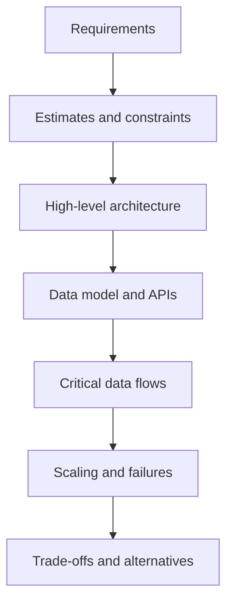
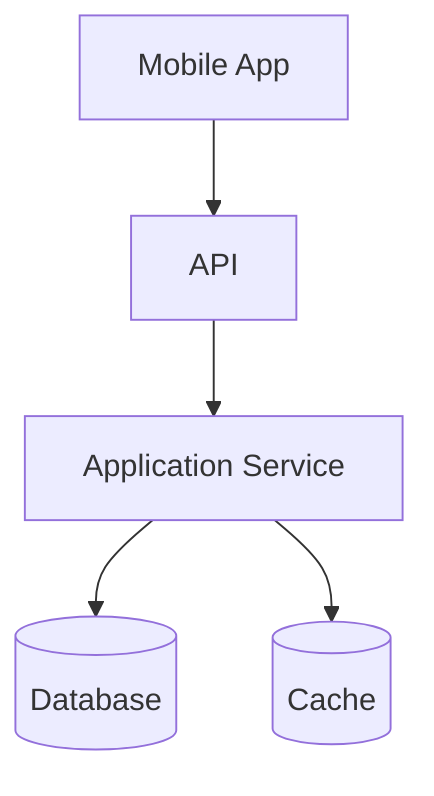

# System Design Fundamentals

System design describes how a product works across clients, APIs, services, storage, caches, queues, workers, and external systems. Android application architecture organizes code inside the client; system design follows data and responsibility across the whole product.

```text
Application architecture: UI -> ViewModel -> use case -> repository -> local/remote data
System design: Mobile client -> APIs -> services -> databases / caches / queues / workers
```

This section approaches system design from a senior mobile engineer's perspective. The mobile app is one participant in a distributed system, so the important questions include contracts, data ownership, synchronization, compatibility, failure behavior, and what the user sees on an unreliable network or after the process is killed.

**Compact reference:** [System Design Shorts](system-design-shorts.md)

## Requirements and system boundaries

A system boundary states what the design owns and what it treats as an external dependency. Each component inside the boundary needs a clear responsibility, interface, and data owner. An API contract, database schema, or event is a boundary between components, not merely an implementation detail.

Start with **functional requirements**: what users and other systems must be able to do. Then make the most important **non-functional requirements** measurable:

- latency, such as p95 response time rather than only an average;
- throughput and expected peak traffic;
- availability and durability targets;
- consistency and acceptable data staleness;
- security, privacy, cost, and operability.

Also state assumptions: active users, request rate, data volume and growth, regions, device connectivity, budget, existing platforms, and regulatory constraints. These assumptions prevent premature complexity and reveal when the design must be revisited.

There is rarely one universally correct architecture. A good design is a set of choices justified by explicit requirements and constraints.

## A reusable design process



1. Clarify the scope and prioritize the critical user journeys.
2. Estimate orders of magnitude: peak requests per second, payload size, storage growth, and read/write ratio. Precision is less important than exposing dominant costs.
3. Draw the smallest high-level design that satisfies the requirements.
4. Define core entities, ownership, APIs, and success semantics.
5. Walk through important read and write paths, including retries and partial failures.
6. Identify bottlenecks, observability needs, and ways to evolve the design.
7. State trade-offs and rejected alternatives.

The process is iterative. A requirement to durably store a write before acknowledgement may change both the API and data model. A discovered bottleneck may change component boundaries. Record important decisions together with the assumptions behind them.

## Data ownership and contracts



For every critical flow, identify:

- where data originates and which component is authoritative;
- where copies exist and how they become stale or synchronized;
- when an operation is considered successful;
- whether retries can duplicate side effects;
- how clients and servers evolve without breaking each other.

The source of truth is scoped. A server database may own canonical product state, while a local database is the source the Android UI reads and observes. Synchronization connects these scopes; it does not make every copy immediately identical.

Contracts should cover more than the happy-path payload. Define validation errors, authorization, timeouts, pagination, partial success, duplicate requests, version compatibility, and idempotency for retried mutations. A timeout is an unknown outcome: the server may have completed the operation even though the client did not receive the response.

## Quality attributes and trade-offs

- **Latency** is the time one operation takes; **throughput** is the amount of work completed per unit of time.
- **Availability** is the ability to serve valid requests; **durability** is the ability to preserve acknowledged state.
- **Consistency** describes which versions of state observers may see and when.
- **Scalability** is the ability to handle growth without unacceptable loss of quality or cost efficiency.
- **Reliability** is broader than availability: the system must behave correctly and predictably under expected conditions and failures.

These qualities interact. Waiting for more replicas may improve durability but increase write latency. Serving a stale cache entry may preserve availability but reduce freshness. An SLI measures observed service behavior; an SLO gives a target for that measure. User-visible client metrics can reveal failures or latency hidden by server-only monitoring.

## Bottlenecks, failures, and observability

Trace both normal and degraded paths. A bottleneck may be CPU, database writes, a hot key, a connection pool, an external quota, or a slow client network. A dependency may become slow rather than fully unavailable. One region can fail while others remain healthy. A write can succeed after the caller times out.

For mobile clients, also consider process death, background execution limits, intermittent connectivity, duplicated retries, old app versions, and long periods without an update. Decide what the UI shows while data is loading, stale, queued, rejected, or awaiting reconciliation.

Observability should follow the critical path. Use metrics for latency, traffic, errors, and saturation; structured logs for diagnosis; and tracing or correlation IDs across component boundaries. Monitor the user-visible outcome, not only whether individual servers are running.

Useful review questions:

- What is the source of truth in each scope?
- Which operations dominate reads, writes, storage, or network usage?
- What latency and freshness are acceptable to the user?
- What happens when a dependency is slow or unavailable?
- Can a retry duplicate a mutation?
- Which state must survive failures or process death?
- What is likely to become the first bottleneck?
- Which assumption would force the design to change?

The goal is not to draw more boxes. It is to make ownership, contracts, critical paths, failure behavior, and trade-offs explicit enough to evaluate.

## See also

- [Scalability & Capacity](scalability-capacity.md)
- [Data Storage & Consistency](data-storage-consistency.md)
- [Caching & Data Freshness](caching.md)
- [Async Processing & Messaging](async-messaging.md)
- [Reliability & Failure Handling](reliability.md)
- [System Design Diagrams](diagrams.md)
- [Offline-First Mobile Application](offline-first-mobile.md)
- [Architecture Basics](../../architecture/basics.md)
