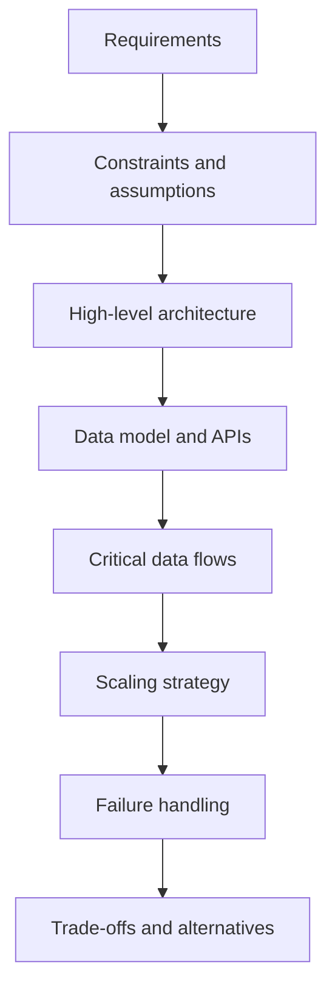
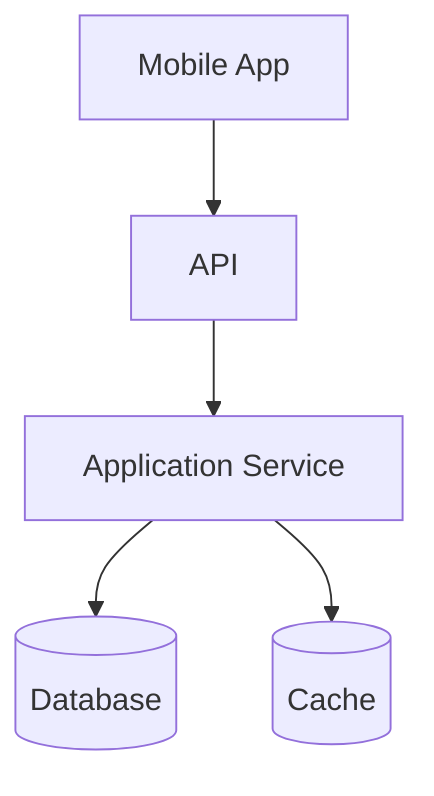

# System Design Fundamentals

System design describes how a complete product works across clients, APIs, services, storage, caches, queues, workers, and external systems. Android application architecture organizes code inside the client, while system design follows data and responsibility across the whole system.

```text
Application architecture: UI -> ViewModel -> use case -> repository -> local/remote data
System design: Mobile client -> APIs -> services -> databases / caches / queues / workers
```

This section approaches system design primarily from a senior mobile engineer's perspective. The mobile application is one participant in a larger distributed system, so backend and infrastructure concepts are covered to the depth needed to reason about contracts, data ownership and flow, synchronization, caching, reliability, product-visible consistency, failure behavior, connectivity, and mobile lifecycle constraints.

**Compact reference:** [System Design Shorts](system-design-shorts.md)

## Boundaries, components, and requirements

A system boundary states what the design owns and what it treats as an external dependency. Inside it, each component needs a clear responsibility, interface, and data owner. An API contract, database schema, or event is a boundary between components, not merely an implementation detail.

Start with **functional requirements**: what users and other systems must be able to do. Then identify **non-functional requirements**, such as latency, throughput, availability, durability, consistency, security, cost, and operability. Assumptions and constraints make these requirements concrete: expected traffic, data volume, regions, device connectivity, budget, existing platforms, and regulatory limits can all change the design.

There is rarely one universally correct architecture. A good design is a set of choices made under explicit requirements and constraints.

## A reusable design process



The process is iterative. Discovering that a write must be durable before acknowledgement may change the data model and API. Finding a bottleneck may change component boundaries. Record important decisions and the assumptions behind them so the design can be revisited when conditions change.

## Data flow and quality attributes



For every critical flow, identify where data originates, which component is the source of truth, where state is copied, and when success is reported. Interfaces should express ownership and failure semantics: validation errors, timeouts, duplicate requests, partial success, and version compatibility.

Important qualities interact:

- **Latency** is the time one operation takes; **throughput** is the amount of work completed per unit of time.
- **Availability** is the ability to serve requests; **durability** is the ability to preserve acknowledged state.
- **Consistency** describes which versions of state observers may see and when.
- **Scalability** is the ability to handle growth without unacceptable loss of quality or cost efficiency.

Improving one quality can weaken another. Waiting for replicas may improve durability but increase write latency. Serving a stale cache entry may preserve availability but reduce freshness.

## Bottlenecks and failure modes

Trace both the normal path and failures. A bottleneck may be CPU, database writes, a hot key, a connection pool, an external quota, or a slow client network. A failure mode describes what can fail and what the user observes: a dependency may be slow rather than fully unavailable, a write may succeed after the caller times out, or only one region may lose connectivity.

Useful questions include:

- What is the source of truth?
- Which operations dominate reads or writes?
- What latency is acceptable?
- What happens when a dependency is unavailable?
- Which data can be stale?
- Which state must survive failures?
- Which component is likely to become a bottleneck?
- What assumptions would change the design?

The goal is not to draw more boxes. It is to make data ownership, critical paths, failure behavior, and trade-offs explicit enough to evaluate.

## See also

- [Scalability & Capacity](scalability-capacity.md)
- [Data Storage & Consistency](data-storage-consistency.md)
- [Caching & Data Freshness](caching.md)
- [Async Processing & Messaging](async-messaging.md)
- [Reliability & Failure Handling](reliability.md)
- [System Design Diagrams](diagrams.md)
- [Architecture Basics](../../architecture/basics.md)
