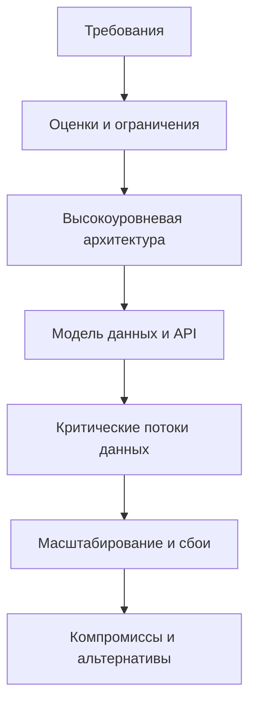
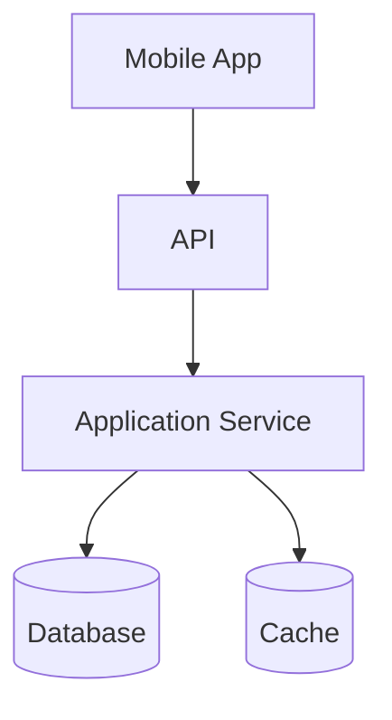

# Основы System Design

System design описывает работу продукта целиком: от клиентов и API до сервисов, хранилищ, кэшей, очередей, workers и внешних систем. Android application architecture организует код внутри клиента, а system design рассматривает движение данных и распределение ответственности во всём продукте.

```text
Application architecture: UI -> ViewModel -> use case -> repository -> local/remote data
System design: Mobile client -> APIs -> services -> databases / caches / queues / workers
```

Этот раздел рассматривает system design с позиции senior mobile engineer. Мобильное приложение является одним из участников распределённой системы, поэтому важны контракты, владение данными, синхронизация, совместимость, поведение при сбоях и то, что увидит пользователь при нестабильной сети или после завершения процесса.

**Краткий справочник:** [System Design Shorts](system-design-shorts.ru.md)

## Требования и границы системы

Граница системы определяет, чем владеет проектируемое решение, а что считает внешней зависимостью. У каждого компонента внутри должны быть понятные ответственность, интерфейс и владелец данных. Контракт API, схема базы или событие образуют границу между компонентами, а не просто служат деталями реализации.

Начните с **функциональных требований**: что должны уметь пользователи и другие системы. Затем сделайте основные **нефункциональные требования** измеримыми:

- latency, например p95 времени ответа, а не только среднее значение;
- throughput и ожидаемая пиковая нагрузка;
- целевые availability и durability;
- consistency и допустимая устарелость данных;
- безопасность, конфиденциальность, стоимость и удобство эксплуатации.

Также зафиксируйте предположения: активные пользователи, частота запросов, объём и рост данных, регионы, качество связи на устройствах, бюджет, существующие платформы и регуляторные ограничения. Они помогают избежать преждевременной сложности и показывают, когда дизайн нужно пересмотреть.

У архитектуры редко бывает один универсально правильный вариант. Хороший дизайн состоит из решений, обоснованных явно сформулированными требованиями и ограничениями.

## Универсальный процесс проектирования



1. Уточните границы задачи и выберите основные пользовательские сценарии.
2. Оцените порядки величин: пиковые запросы в секунду, размер payload, рост хранилища и соотношение чтений к записям. Точность менее важна, чем выявление основных затрат.
3. Нарисуйте минимальную высокоуровневую схему, удовлетворяющую требованиям.
4. Определите основные сущности, владение, API и условия успешной операции.
5. Проследите важные пути чтения и записи, включая retries и частичные отказы.
6. Найдите bottlenecks, требования к observability и способы развития системы.
7. Назовите компромиссы и отклонённые альтернативы.

Процесс итеративный. Требование надёжно сохранить запись до подтверждения может изменить и API, и модель данных. Обнаруженный bottleneck может потребовать других границ компонентов. Важные решения стоит фиксировать вместе с предположениями, на которых они основаны.

## Владение данными и контракты



Для каждого критического потока определите:

- где возникают данные и какой компонент является авторитетным;
- где существуют копии и как они устаревают или синхронизируются;
- в какой момент операция считается успешной;
- могут ли retries повторить побочные эффекты;
- как клиенты и серверы развиваются без нарушения совместимости.

Source of truth имеет область действия. Серверная база может владеть каноническим состоянием продукта, а локальная база быть источником, который читает и наблюдает Android UI. Синхронизация связывает эти области, но не делает все копии мгновенно одинаковыми.

Контракты должны описывать не только успешный payload. Определите validation errors, авторизацию, timeouts, пагинацию, частичный успех, повторные запросы, совместимость версий и idempotency для повторяемых мутаций. Timeout означает неизвестный результат: сервер мог завершить операцию, хотя клиент не получил ответ.

## Характеристики системы и компромиссы

- **Latency** - время выполнения одной операции, **throughput** - объём работы за единицу времени.
- **Availability** - способность обслуживать корректные запросы, **durability** - способность сохранять подтверждённое состояние.
- **Consistency** определяет, какие версии состояния и когда могут видеть наблюдатели.
- **Scalability** - способность выдерживать рост без неприемлемого ухудшения качества или стоимости.
- **Reliability** шире availability: система должна работать правильно и предсказуемо в ожидаемых условиях и при сбоях.

Эти свойства связаны. Ожидание большего числа реплик может повысить durability, но увеличить latency записи. Выдача устаревшего значения из кэша может сохранить availability ценой freshness. SLI измеряет наблюдаемое поведение сервиса, а SLO задаёт целевое значение этой метрики. Пользовательские метрики на клиенте могут показать ошибки и задержки, которые не видны при мониторинге только серверов.

## Bottlenecks, сбои и observability

Прослеживайте как штатные, так и деградировавшие пути. Bottleneck может возникнуть в CPU, записи в базу, горячем ключе, пуле соединений, квоте внешней системы или медленной мобильной сети. Зависимость может замедлиться, а не полностью отключиться. Один регион может отказать, пока остальные работают. Запись может завершиться уже после timeout у вызывающей стороны.

Для mobile-клиента также учитывайте завершение процесса, ограничения фоновой работы, нестабильную связь, дублирующиеся retries, старые версии приложения и долгие периоды без обновления. Определите, что UI показывает, пока данные загружаются, устарели, поставлены в очередь, отклонены или ожидают разрешения конфликта.

Observability должна охватывать весь критический путь. Используйте метрики latency, traffic, errors и saturation, структурированные логи для диагностики и tracing или correlation IDs на границах компонентов. Следите за видимым пользователю результатом, а не только за доступностью отдельных серверов.

Полезные вопросы для проверки:

- Что является source of truth в каждой области?
- Какие операции создают основную нагрузку на чтение, запись, хранилище или сеть?
- Какие latency и freshness приемлемы для пользователя?
- Что произойдёт, если зависимость замедлится или станет недоступной?
- Может ли retry продублировать мутацию?
- Какое состояние должно пережить сбой или завершение процесса?
- Что вероятнее всего станет первым bottleneck?
- Какое предположение способно изменить дизайн?

Цель не в количестве блоков на схеме. Важно сделать владение, контракты, критические пути, поведение при сбоях и компромиссы достаточно явными для оценки решения.

## См. также

- [Scalability & Capacity](scalability-capacity.ru.md)
- [Data Storage & Consistency](data-storage-consistency.ru.md)
- [Caching & Data Freshness](caching.ru.md)
- [Async Processing & Messaging](async-messaging.ru.md)
- [Reliability & Failure Handling](reliability.ru.md)
- [System Design Diagrams](diagrams.ru.md)
- [Offline-First Mobile Application](offline-first-mobile.ru.md)
- [Architecture Basics](../../architecture/basics.ru.md)
