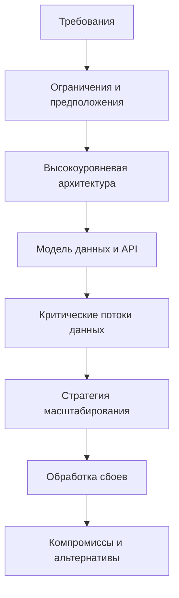
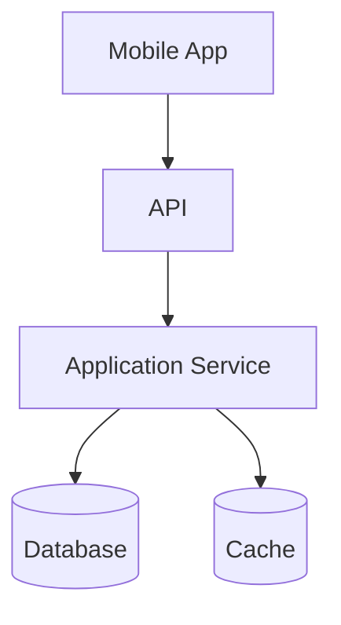

# Основы System Design

System design описывает работу продукта целиком: от клиентов и API до сервисов, хранилищ, кэшей, очередей, workers и внешних систем. Android application architecture организует код внутри клиента, а system design рассматривает движение данных и распределение ответственности во всей системе.

```text
Application architecture: UI -> ViewModel -> use case -> repository -> local/remote data
System design: Mobile client -> APIs -> services -> databases / caches / queues / workers
```

Этот раздел рассматривает system design прежде всего с позиции senior mobile engineer. Мобильное приложение является одним из участников большой распределённой системы, поэтому концепции backend и инфраструктуры разобраны в объёме, необходимом для понимания контрактов, владения данными и их движения, синхронизации, кэширования, надёжности, видимой пользователю consistency, поведения при сбоях, качества связи и ограничений mobile lifecycle.

## Границы, компоненты и требования

Граница системы определяет, чем владеет проектируемое решение, а что считает внешней зависимостью. У каждого компонента внутри должны быть понятные ответственность, интерфейс и владение данными. Контракт API, схема базы или событие образуют границу между компонентами, а не просто служат деталями реализации.

Начните с **функциональных требований**: что должны уметь пользователи и другие системы. Затем определите **нефункциональные требования**: latency, throughput, availability, durability, consistency, безопасность, стоимость и удобство эксплуатации. Предположения и ограничения делают требования конкретными: ожидаемый трафик, объём данных, регионы, качество связи на устройствах, бюджет, существующие платформы и регуляторные нормы могут изменить решение.

У архитектуры редко бывает один универсально правильный вариант. Хороший дизайн состоит из решений, принятых с учётом явно сформулированных требований и ограничений.

## Универсальный процесс проектирования



Процесс итеративный. Требование сохранять запись до подтверждения может изменить модель данных и API. Обнаруженный bottleneck может потребовать других границ компонентов. Важные решения и стоящие за ними предположения стоит фиксировать, чтобы пересматривать дизайн при изменении условий.

## Поток данных и характеристики системы



Для каждого критического потока определите, где данные возникают, какой компонент является source of truth, где появляются копии состояния и в какой момент операция считается успешной. Интерфейсы должны описывать владение и поведение при ошибках: validation errors, timeouts, повторные запросы, частичный успех и совместимость версий.

Основные характеристики связаны между собой:

- **Latency** - время выполнения одной операции, **throughput** - объём работы за единицу времени.
- **Availability** - способность обслуживать запросы, **durability** - способность сохранять подтверждённое состояние.
- **Consistency** определяет, какие версии состояния и когда могут видеть наблюдатели.
- **Scalability** - способность выдерживать рост без неприемлемого ухудшения качества или стоимости.

Улучшение одного свойства может ослабить другое. Ожидание реплик повышает durability, но увеличивает latency записи. Выдача устаревшего значения из кэша может сохранить availability ценой freshness.

## Bottlenecks и сценарии отказа

Прослеживайте как штатный путь, так и отказы. Bottleneck может возникнуть в CPU, записи в базу, горячем ключе, пуле соединений, квоте внешней системы или медленной мобильной сети. Сценарий отказа описывает не только сам сбой, но и то, что увидит пользователь: зависимость может сильно замедлиться, запись может завершиться после timeout у клиента, а связь может пропасть только в одном регионе.

Полезные вопросы:

- Что является source of truth?
- Какие операции преобладают, чтения или записи?
- Какая latency допустима?
- Что произойдёт при недоступности зависимости?
- Какие данные могут быть устаревшими?
- Какое состояние должно переживать сбои?
- Какой компонент вероятнее всего станет bottleneck?
- Какие предположения способны изменить дизайн?

Цель не в количестве блоков на схеме. Важно сделать владение данными, критические пути, поведение при сбоях и компромиссы достаточно явными для оценки решения.

## См. также

- [Scalability & Capacity](scalability-capacity.ru.md)
- [Data Storage & Consistency](data-storage-consistency.ru.md)
- [Caching & Data Freshness](caching.ru.md)
- [Async Processing & Messaging](async-messaging.ru.md)
- [Reliability & Failure Handling](reliability.ru.md)
- [System Design Diagrams](diagrams.ru.md)
- [Architecture Basics](../../architecture/basics.ru.md)
