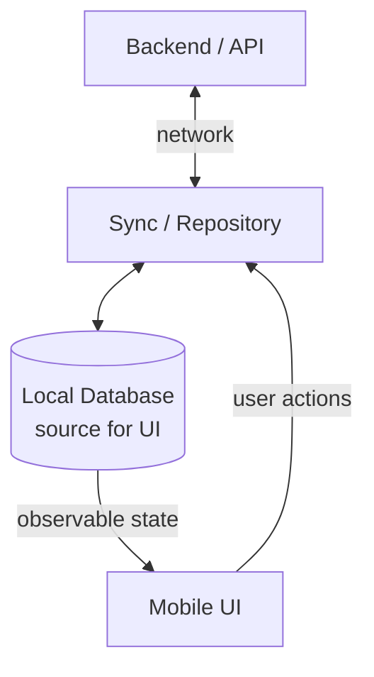
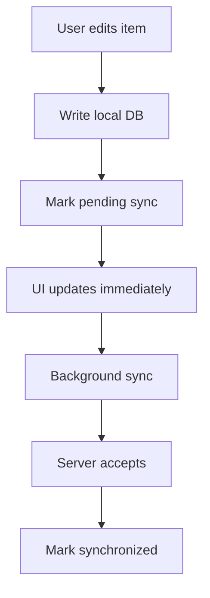
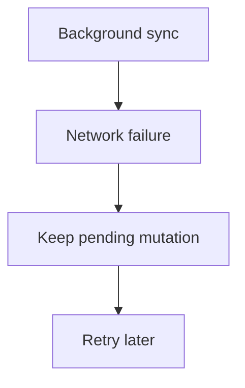

# Design Example: Offline-First Mobile Application

An offline-first application remains useful with intermittent connectivity. Users can read previously loaded content, make local changes, and synchronize later without losing work. The mobile app is one participant in a wider system, not a temporary screen around an API response.

## Requirements

### Functional requirements

- Read cached content without a network connection.
- Create and edit data offline.
- Synchronize local changes when connectivity returns.
- Receive newer server state while online.

### Non-functional requirements

- Responsive local UI.
- No silent loss of user-authored data.
- Eventual synchronization under recoverable conditions.
- Resilience to intermittent network and backend failures.
- Reasonable battery, network, and storage usage.

Assume authenticated users may use more than one device, edits can conflict, and background execution is not continuous. The exact consistency and conflict rules remain domain decisions.

## High-level architecture

The local database is the immediate source for UI state. Network synchronization writes accepted server state into the database; the UI continues to observe the same source instead of switching between unrelated “network state” and “database state.” The backend remains authoritative for shared server state, authorization, and cross-device coordination.

The repository owns the client boundary: local reads and writes, network calls, mapping, and sync policy. This extends the [Repository and single-source-of-truth](../../architecture/basics.md#data-ownership) ideas without duplicating their application-layer details.

## Local state and mutation model

Records need stable identifiers that can be created offline. A client-generated UUID is one option; another is a local identifier mapped to a server identifier. Each mutation should have a stable operation ID, type, target, payload or patch, creation time, and sync state such as `pending`, `in_flight`, `failed`, or `synchronized`.

Pending mutations must be stored durably with the affected data. An in-memory queue would lose work after process death. The local transaction should update the visible record and enqueue its mutation together when the storage technology supports it.

This is an optimistic update: the UI reflects the intended result before server confirmation. Show a pending or failed state when users need to understand that shared state has not yet synchronized.

## Synchronization flow

A sync run can:

1. Load a bounded batch of pending mutations in deterministic order.
2. Send each operation with its stable ID or idempotency key.
3. Apply the server response and authoritative version to the local database.
4. Mark accepted operations synchronized.
5. Pull server changes since a cursor or version and merge them locally.

If the network fails, keep the mutation pending and retry later with bounded backoff and jitter:

Connectivity callbacks can trigger an attempt but should not be treated as proof that the backend is reachable. On Android, `WorkManager` is suitable for deferrable persistent synchronization under constraints; its scheduling and platform limits are covered in [Background Work & System Behavior](../../android/background-work-system-behavior.md).

Batching mutations saves radio wakeups and server overhead but increases synchronization delay. Aggressive synchronization improves freshness at the cost of battery and network usage. Foreground user actions may justify an immediate attempt while durable background work remains the recovery path.

## Conflicts and server updates

Conflicts occur when local and server versions change independently. Possible strategies include:

- **Server wins:** simple, but may discard unsynchronized user intent.
- **Client wins:** preserves the local edit, but can overwrite newer remote state.
- **Last-write-wins:** easy to automate, but device clocks and semantic intent make timestamps imperfect.
- **Field-level merge:** preserves independent edits, but needs versioned fields and clear rules.
- **Domain-specific resolution:** uses business semantics or asks the user when automatic merging would be unsafe.

No strategy is universally correct. A note title, inventory count, and financial transfer have different correctness requirements. Version numbers or entity tags can let the server detect that the client's base version is stale.

Server updates may arrive through polling, push-triggered refresh, or a real-time channel. Regardless of transport, write normalized results into the local source of truth. Record a last-successful-sync time or version so the UI can communicate staleness where it matters.

## Deletion, failures, and recovery

Deleting a local row immediately can erase the information needed to synchronize the deletion. A tombstone records that the entity is deleted until the server acknowledges it and relevant replicas have had time to observe it. Retention and cleanup rules prevent tombstones from growing forever.

Retries require idempotent server handling because a response can be lost after a successful write. Permanent validation or authorization failures should not retry indefinitely. Preserve the local user content, expose a recoverable error where useful, and provide reconciliation or manual correction for conflicts that cannot be merged.

The sync engine should expose observability for pending count, oldest mutation age, failure reasons, last success, and conflict rate. Tests should cover process death, duplicate delivery, out-of-order responses, schema migration, account switching, and long periods offline.

## Trade-offs

- Offline capability increases state-management and testing complexity.
- Local-first UX reduces perceived latency and supports weak connectivity.
- Conflict resolution becomes an explicit product and domain decision.
- Aggressive synchronization improves freshness but costs battery and network.
- Batching saves resources but increases synchronization delay.
- Optimistic updates feel immediate but require visible recovery when rejected.

## Further design exercises

Future examples can apply the same reasoning to Real-time Chat, Live Location Tracking, a Push Notification System, Media Upload & Processing, File Synchronization, and an Analytics Event Pipeline.

## See also

- [System Design Fundamentals](fundamentals.md)
- [Data Storage & Consistency](data-storage-consistency.md)
- [Caching & Data Freshness](caching.md)
- [Reliability & Failure Handling](reliability.md)
- [Android Storage](../../android/storage.md)
