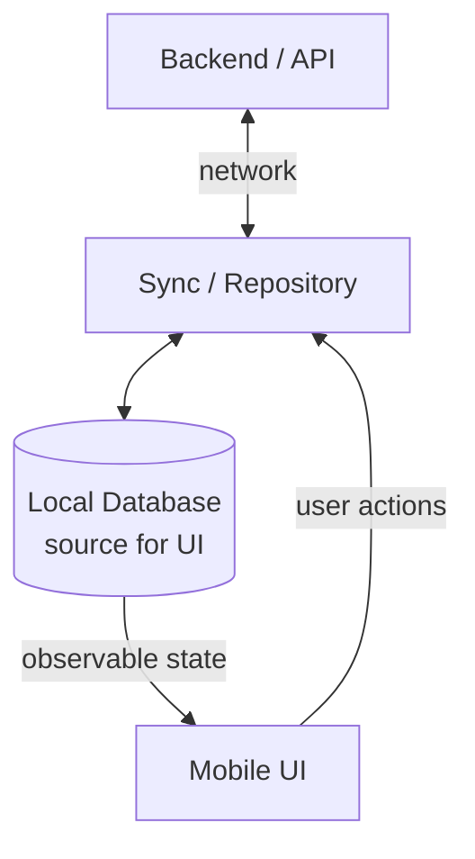
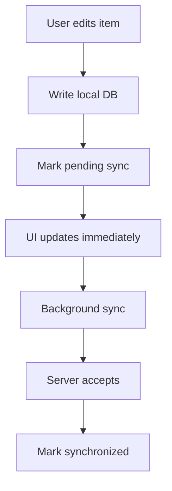
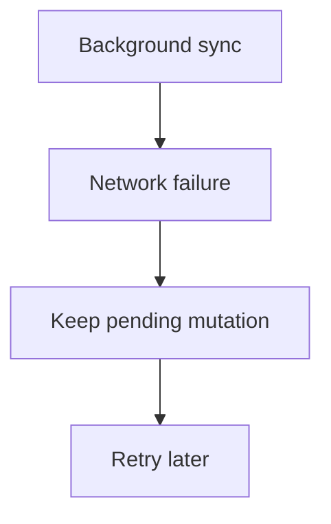

# Пример проектирования: Offline-First Mobile Application

Offline-first приложение остаётся полезным при нестабильной связи. Пользователь может читать ранее загруженный контент, менять локальные данные и синхронизировать их позже без потери работы. Мобильное приложение является участником более широкой системы, а не временным экраном вокруг ответа API.

## Требования

### Функциональные требования

- Читать кэшированный контент без сети.
- Создавать и редактировать данные offline.
- Синхронизировать локальные изменения после восстановления связи.
- Получать более свежие серверные данные online.

### Нефункциональные требования

- Отзывчивый локальный UI.
- Отсутствие незаметной потери пользовательских данных.
- Eventual synchronization при устранимых сбоях.
- Устойчивость к временной недоступности сети и backend.
- Разумное использование батареи, сети и хранилища.

Предположим, что авторизованный пользователь может работать на нескольких устройствах, изменения способны конфликтовать, а фоновое выполнение не является непрерывным. Точные правила consistency и разрешения конфликтов остаются доменными решениями.

## Высокоуровневая архитектура

Локальная база является local source of truth отображаемого состояния. Сетевая синхронизация записывает принятое серверное состояние в базу, а UI продолжает наблюдать тот же источник и не переключается между независимыми `network state` и `database state`. Backend остаётся server authority для общего и доменного состояния, авторизации и координации нескольких устройств. Эти роли дополняют друг друга, а не конкурируют как два универсальных source of truth.

Repository владеет клиентской границей: локальными чтениями и записями, сетевыми вызовами, преобразованием моделей и sync policy. Это развивает идеи [Repository и single source of truth](../../architecture/basics.ru.md), не повторяя детали application layer.

## Локальное состояние и модель mutation

Записям нужны стабильные идентификаторы, которые можно создать offline. Один вариант - сгенерированный клиентом UUID, другой - локальный идентификатор с последующим сопоставлением с серверным. У каждой mutation должны быть стабильный operation ID, тип, target, payload или patch, время создания и sync state: `pending`, `in_flight`, `failed` или `synchronized`.

Pending mutations необходимо хранить долговечно вместе с затронутыми данными. In-memory queue потеряет работу после завершения процесса. Локальная транзакция должна атомарно обновлять видимую запись и добавлять операцию в очередь в одной базе. Если раздельные хранилища неизбежны, нужен протокол восстановления после сбоя.

`in_flight` обозначает одну попытку, а не постоянное состояние. Если процесс завершился, истёк timeout попытки или срок её processing lease, незавершённая mutation должна снова стать доступной для retry, а не застрять навсегда. Стабильный operation ID или idempotency key делает повторную отправку безопасной при неопределённом результате предыдущего запроса. Для операций с чувствительными side effects перед повтором может потребоваться reconciliation или запрос статуса.

Это optimistic update: UI показывает ожидаемый результат до подтверждения сервера. Если пользователю важно знать, что общее состояние ещё не синхронизировано, покажите статус `pending` или `failed`.

## Поток синхронизации

Один запуск sync может:

1. Загрузить ограниченный batch pending mutations в детерминированном порядке.
2. Отправить каждую операцию со стабильным ID или idempotency key.
3. В одной локальной транзакции применить ответ сервера и авторитетную версию, затем пометить принятую операцию как синхронизированную. Потеря ответа должна оставлять возможность безопасного повтора.
4. Получить серверные изменения после cursor или version и объединить их локально.

При отказе сети mutation остаётся pending, а её отправка повторяется позже с ограниченным backoff и jitter:

Connectivity callbacks могут инициировать попытку, но не доказывают доступность backend. В Android `WorkManager` подходит для отложенной устойчивой синхронизации с constraints; его планирование и ограничения платформы разобраны в [Background Work & System Behavior](../../android/background-work-system-behavior.ru.md).

Batching mutations сокращает пробуждения радиомодуля и server overhead, но увеличивает задержку синхронизации. Агрессивная синхронизация повышает freshness ценой батареи и трафика. Действие пользователя на переднем плане может оправдать немедленную попытку, а durable background work остаётся путём восстановления.

## Конфликты и серверные обновления

Конфликт возникает, когда локальная и серверная версии меняются независимо. Возможные стратегии:

- **Server wins:** просто, но несинхронизированное намерение пользователя может потеряться.
- **Client wins:** сохраняет локальную правку, но может перезаписать более новое удалённое состояние.
- **Last-write-wins:** легко автоматизировать, но часы устройств и смысл изменений делают timestamps несовершенными.
- **Field-level merge:** сохраняет независимые edits, но требует версий полей и чётких правил.
- **Domain-specific resolution:** использует бизнес-семантику или спрашивает пользователя, если автоматическое объединение небезопасно.

Универсально правильной стратегии нет. Название заметки, остаток товара и финансовый перевод предъявляют разные требования. Номер версии или entity tag позволяет серверу определить, что базовая версия клиента устарела.

Серверные изменения могут приходить через polling, push-triggered refresh или real-time channel. Независимо от транспорта нормализованный результат записывается в локальный source of truth. Время или версия последней успешной синхронизации позволяют UI показывать, насколько устарели данные, там, где это существенно.

## Удаление, сбои и восстановление

Немедленное удаление локальной строки может стереть информацию, необходимую для синхронизации удаления. Tombstone отмечает сущность как удалённую до подтверждения сервером. На сервере также нужна политика хранения сведений об удалении, чтобы клиент после долгого offline не восстановил удалённые данные. Правила retention и cleanup не дают tombstones расти бесконечно.

Retries требуют идемпотентной обработки на сервере, поскольку ответ может потеряться после успешной записи. Постоянные ошибки validation или authorization не следует повторять бесконечно. Сохраняйте локальный пользовательский контент, показывайте устранимую ошибку там, где это полезно, и предусмотрите reconciliation или ручное исправление конфликтов, которые нельзя объединить.

Sync engine должен предоставлять observability для числа pending операций, возраста самой старой mutation, причин ошибок, последнего успеха и частоты конфликтов. Тесты должны покрывать завершение процесса, повторную доставку, ответы не по порядку, миграцию схемы, смену аккаунта и длительный offline. При выходе из аккаунта разделяйте или удаляйте его данные и ожидающие операции согласно политике хранения продукта.

## Компромиссы

- Offline capability усложняет управление состоянием и тестирование.
- Local-first UX снижает воспринимаемую latency и поддерживает слабую связь.
- Разрешение конфликтов становится явным продуктовым и доменным решением.
- Агрессивная синхронизация повышает freshness, но расходует батарею и сеть.
- Batching экономит ресурсы, но увеличивает задержку синхронизации.
- Optimistic updates дают быстрый отклик, но требуют понятного восстановления при отказе.

## Дальнейшие упражнения

Те же принципы можно применить к будущим примерам: Real-time Chat, Live Location Tracking, Push Notification System, Media Upload & Processing, File Synchronization и Analytics Event Pipeline.

## См. также

- [Основы System Design](fundamentals.ru.md)
- [Data Storage & Consistency](data-storage-consistency.ru.md)
- [Caching & Data Freshness](caching.ru.md)
- [Reliability & Failure Handling](reliability.ru.md)
- [Android Storage](../../android/storage.ru.md)
