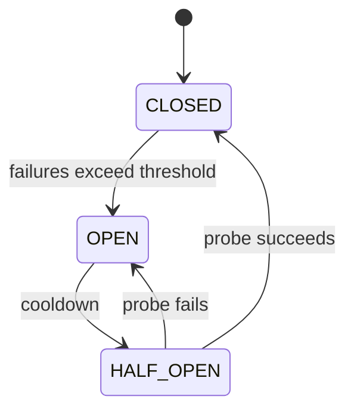

# Reliability & Failure Handling

Distributed systems fail partially: one dependency may be slow, one request may time out, or one region may be unreachable while the rest continues. Reliability comes from defined failure behavior, controlled recovery, and evidence from observability, not from assuming failures are rare.

## Timeouts and retries

Every remote call needs a timeout derived from the caller's latency budget. Without one, blocked calls consume connections, threads, memory, and user patience. A timeout creates uncertainty: the caller knows it stopped waiting, not whether the remote operation completed.

Retries can recover from transient failures but also multiply load and repeat side effects. Use a retry budget, bounded attempts, exponential backoff, and jitter. Coordinate retry layers so the client, API, and service do not create a retry storm.

```text
Mobile App -> API -> Payment Service -> timeout
```

Blindly retrying a payment can charge twice if the first request succeeded but its response was lost. Operation semantics determine whether a retry is safe. An idempotency key lets the service recognize the same logical operation:

```http
POST /payments
Idempotency-Key: <stable-request-identifier>
```

The service must persist the key and result within an appropriate scope and retention period. A header alone does not provide idempotency.

## Isolation and graceful degradation

A circuit breaker stops calls to a dependency after a failure threshold, waits for a cooldown, and allows limited probes before normal traffic resumes:



It protects resources and reduces repeated calls to a failing dependency, but it needs suitable thresholds and is not required in every application process. Concurrency limits, bulkheads, and queues can isolate one overloaded dependency from unrelated work.

Graceful degradation preserves core behavior when an optional dependency fails. If recommendations are unavailable, the product may still show search and the user's saved content. A fallback must be safe and honest: stale prices or authorization decisions may be worse than an explicit error.

## Redundancy and recovery

Redundancy removes single points of failure only when replicas do not share the same failure mode. Health checks should distinguish whether a process is alive, ready to receive traffic, and able to reach critical dependencies. Replication improves resilience but can introduce lag and correlated configuration errors.

Design for partial success and uncertain outcomes. A multi-step workflow may need compensating action, reconciliation, or a visible pending state rather than pretending it was atomic. Recovery plans should cover restoring durable data, draining backlogs, replaying safe work, and verifying invariants.

## Observability is part of reliability

Logs, metrics, traces, and domain-level signals should answer which operation failed, where time was spent, whether retries helped, and what users experienced. Monitor latency percentiles, error rate, saturation, queue age, dependency health, and business outcomes. Alerts should lead to an actionable response rather than report every transient event.

Reliable behavior is a trade-off among availability, correctness, latency, cost, and operational complexity. Define the failure that matters, then choose the smallest mechanism that addresses it.

## See also

- [Async Processing & Messaging](async-messaging.md)
- [Caching & Data Freshness](caching.md)
- [Offline-First Mobile Application](offline-first-mobile.md)
- [Logging and Diagnostic Data](../../tools/logging-diagnostics.md)
- [Crash Reporting and Production Monitoring](../../tools/crash-monitoring.md)
