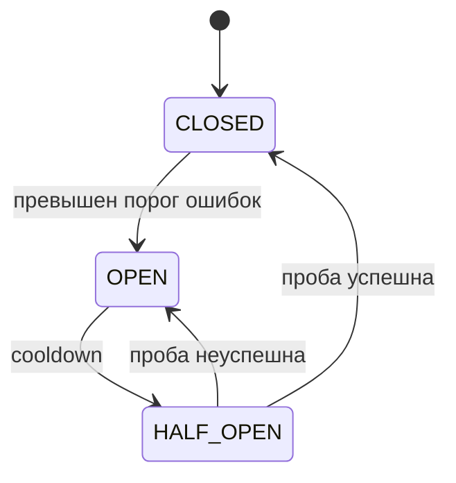

# Reliability & Failure Handling

В распределённых системах происходят частичные отказы: одна зависимость замедляется, один запрос получает timeout или один регион теряет связь, пока остальная система продолжает работать. Надёжность строится на определённом поведении при сбоях, контролируемом восстановлении и данных observability, а не на предположении, что отказы редки.

## Timeouts и retries

У каждого удалённого вызова должен быть timeout, выведенный из latency budget вызывающей стороны. Без него зависшие вызовы занимают соединения, потоки, память и время пользователя. Timeout создаёт неопределённость: вызывающая сторона знает, что перестала ждать, но не знает, завершилась ли удалённая операция.

Retries помогают при временных сбоях, но также умножают нагрузку и могут повторить side effects. Используйте retry budget, ограниченное число попыток, exponential backoff и jitter. Координируйте уровни retries, чтобы клиент, API и сервис не создали retry storm.

```text
Mobile App -> API -> Payment Service -> timeout
```

Слепой повтор платежа может списать деньги дважды, если первый запрос завершился, но ответ потерялся. Безопасность retry зависит от семантики операции. Idempotency key позволяет сервису распознать одну логическую операцию:

```http
POST /payments
Idempotency-Key: <stable-request-identifier>
```

Сервис должен сохранять ключ и результат в подходящей области и в течение заданного срока. Один заголовок сам по себе не обеспечивает идемпотентность.

## Изоляция и graceful degradation

Circuit breaker прекращает вызовы зависимости после порога ошибок, ждёт cooldown и разрешает ограниченные пробные запросы перед восстановлением обычного трафика:



Он защищает ресурсы и сокращает повторные вызовы отказавшей зависимости, но требует подходящих порогов и не обязан находиться в каждом процессе приложения. Лимиты параллелизма, bulkheads и очереди могут изолировать перегруженную зависимость от несвязанной работы.

Graceful degradation сохраняет основное поведение при отказе необязательной зависимости. Если рекомендации недоступны, продукт может продолжить показывать поиск и сохранённый контент. Fallback должен быть безопасным и честным: устаревшие цены или решения авторизации могут быть хуже явной ошибки.

## Redundancy и восстановление

Redundancy устраняет single point of failure, только если реплики не разделяют один сценарий отказа. Health checks должны различать, жив ли процесс, готов ли он принимать трафик и доступны ли критические зависимости. Replication повышает устойчивость, но может вносить lag и общие ошибки конфигурации.

Учитывайте частичный успех и неопределённый результат. Многошаговому workflow может потребоваться compensating action, reconciliation или видимый статус `pending`, а не иллюзия атомарности. План восстановления должен охватывать возврат durable data, обработку backlog, безопасный replay и проверку инвариантов.

## Observability как часть надёжности

Logs, metrics, traces и доменные сигналы должны показывать, какая операция завершилась ошибкой, где потрачено время, помогли ли retries и что увидели пользователи. Отслеживайте перцентили latency, error rate, saturation, возраст очереди, состояние зависимостей и бизнес-результаты. Alerts должны вести к конкретному действию, а не сообщать о каждом кратком сбое.

Надёжное поведение является компромиссом между availability, корректностью, latency, стоимостью и операционной сложностью. Сначала определите важный сценарий отказа, затем выберите минимальный механизм, который его покрывает.

## См. также

- [Async Processing & Messaging](async-messaging.ru.md)
- [Caching & Data Freshness](caching.ru.md)
- [Offline-First Mobile Application](offline-first-mobile.ru.md)
- [Logging and Diagnostic Data](../../tools/logging-diagnostics.ru.md)
- [Crash Reporting and Production Monitoring](../../tools/crash-monitoring.ru.md)
