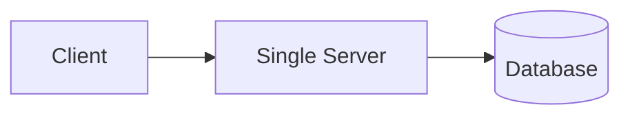
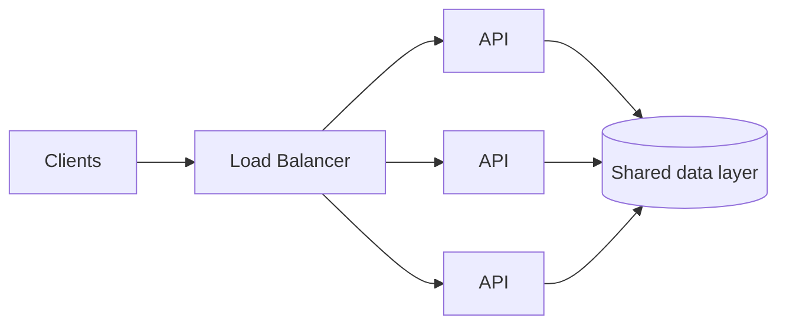

# Scalability & Capacity

Scalability describes how a system preserves acceptable behavior as users, traffic, data, or work grow. Capacity planning estimates when a resource will reach a limit. The goal is to identify likely constraints and maintain enough headroom, not to predict every number exactly.

## Describe the load

**RPS (requests per second)** measures request rate, but it is only one dimension. Also consider:

- concurrent requests and long-lived connections;
- read/write ratio and expensive request types;
- payload size and network bandwidth;
- CPU, memory, disk I/O, and external quotas;
- data volume, retention, and growth rate.

A read-heavy catalog and a write-heavy telemetry pipeline can have similar RPS and very different bottlenecks. Use a workload mix rather than one global number.

**Throughput** is completed work per unit of time. **Concurrency** is work in progress. For a stable system, a useful approximation is:

```text
concurrent requests ≈ requests per second × average time in the system
500 RPS × 0.2 s ≈ 100 concurrent requests
```

Latency and throughput are related but not interchangeable. Increasing concurrency may improve throughput until a resource saturates. When arrival rate exceeds processing capacity, queues grow, tail latency rises, timeouts trigger retries, and the extra retries may amplify the overload. Backpressure, bounded queues, rate limits, and load shedding keep the backlog finite.

## Rough capacity estimation

Start with order-of-magnitude calculations and write down the assumptions:

```text
1,000,000 daily active users
× 10 relevant requests per user per day
= 10,000,000 requests per day
≈ 116 RPS on average

peak RPS ≈ average RPS × peak factor
116 × 8 ≈ 928 RPS
```

The peak factor must come from product expectations or measured traffic; it is not a universal constant. Estimate critical read and write paths separately because endpoint cost and traffic distribution matter more than a single average.

Storage needs a separate estimate:

```text
storage growth ≈ writes per day × bytes per write × retention period × replication factor
```

Include indexes, metadata, backups, compression, and temporary migration space when they are material. For every estimate, record the expected peak, safety margin, and resource or quota likely to fail first.

Validate the model with production measurements and load tests. Test a representative workload until latency or errors become unacceptable, not merely until average CPU looks high. Capacity should cover peak traffic plus failure scenarios: losing one instance, zone, shard, or dependency quota can reduce usable capacity exactly when traffic is being redistributed.

## Mobile load patterns

DAU and average RPS can hide client-driven bursts:

- polling and periodic background work may align on round timestamps;
- many clients can reconnect together after network or service recovery;
- a push notification can trigger a large refresh wave;
- retries can multiply traffic during an outage;
- realtime features consume connection and memory capacity even when message RPS is low.

Clients should avoid synchronized work where possible. Exponential backoff with jitter, bounded retries, server-provided retry hints, caching, request deduplication, and idempotent operations reduce retry storms. The server still needs protection because old application versions and third-party clients may ignore the intended behavior.

## Scaling approaches

**Vertical scaling** gives one node more CPU, memory, or I/O capacity. It is operationally simple but has hardware, cost, and failure-domain limits.

**Horizontal scaling** adds nodes and can improve capacity and redundancy, but requires routing, coordination, deployment, and observability across instances.

Stateless services keep durable request state outside the process, so a load balancer can send requests to interchangeable instances. Stateful components own data or sessions and usually need replication, partitioning, or explicit movement of state.



may evolve into:



A load balancer distributes work, but it does not remove a database bottleneck. Replication can add read capacity and redundancy, while partitioning divides data and write load. Both introduce consistency, routing, rebalancing, and failure-handling concerns.

Autoscaling is reactive: metrics must change, new capacity must start, and load must be redistributed. Keep minimum capacity and headroom for faster bursts. Scale on a signal close to the bottleneck - CPU for compute-bound work; queue depth, active connections, latency, or custom work units elsewhere. Set explicit limits and verify quotas.

## Hotspots and bottlenecks

A system can have spare total capacity and still fail on one hot partition, popular cache key, tenant, region, or lock. Measure utilization, saturation, queue depth, latency percentiles, error rate, traffic mix, and rejected work along the critical path. Averages can hide a small group of very slow requests or an overloaded shard.

Scale the constrained resource, then validate the next constraint. Possible actions include optimizing access patterns, caching suitable reads, batching writes, partitioning data, limiting concurrency, or moving slow work out of the request path.

Capacity balances reliability and cost. Many products are served well by a simple system with measured headroom. Scale when requirements and evidence justify it.

## See also

1. [System Design Fundamentals](fundamentals.md)
2. [Data Storage & Consistency](data-storage-consistency.md)
3. [Caching & Data Freshness](caching.md)
4. [Reliability & Failure Handling](reliability.md)
