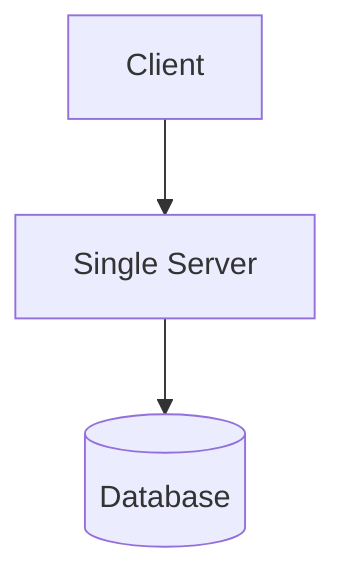
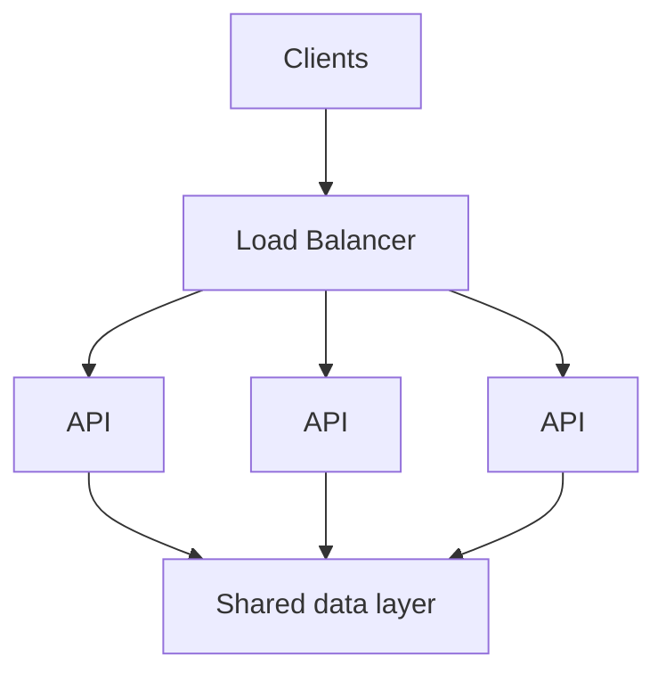

# Scalability & Capacity

Scalability describes how a system preserves acceptable behavior as users, traffic, data, or work grow. Capacity planning estimates when a resource will reach a limit. The purpose is to find likely constraints early, not to predict every number exactly.

## Describe the load

**RPS (Requests Per Second)** measures request rate, but it is only one dimension. Also consider concurrent users or connections, payload size, storage growth, CPU-heavy operations, and external quotas. A read-heavy catalog and a write-heavy telemetry pipeline can have similar RPS and very different bottlenecks.

Latency and throughput are related but not interchangeable. Adding concurrent work may increase throughput until a resource saturates; after that, queues grow and latency can rise sharply. Backpressure limits or rejects incoming work so an overloaded dependency can recover instead of accumulating an unbounded backlog.

## Rough capacity estimation

For an order-of-magnitude estimate:

```text
1,000,000 daily active users
10 relevant requests per user per day
= 10,000,000 requests per day
≈ 116 requests per second on average
```

The average is not a capacity target. Traffic peaks, regional time zones, launches, retries, bursts, and expensive endpoints may multiply the required capacity. Estimate peak read and write paths separately, state the safety margin, measure production behavior, and revise the model.

## Scaling approaches

**Vertical scaling** gives one node more CPU, memory, or I/O capacity. It is simple but has hardware and failure-domain limits. **Horizontal scaling** adds nodes and can improve capacity and redundancy, but requires routing, coordination, deployment, and observability across instances.

Stateless services keep durable request state outside the process, so a load balancer can send requests to interchangeable instances. Stateful components own data or sessions and usually need replication, partitioning, or explicit movement of state.



may evolve into:



A load balancer distributes work, but it does not remove a database bottleneck. Replication can add read capacity and redundancy, while partitioning divides data and write load. Both introduce consistency, routing, rebalancing, and failure-handling concerns.

## Hotspots and bottlenecks

A system can have spare total capacity and still fail on one hot partition, popular cache key, tenant, region, or lock. Measure utilization, queue depth, latency percentiles, error rate, and saturation along the critical path. Averages can hide a small group of very slow requests.

Scale the constrained resource and validate the next constraint. Possible actions include optimizing access patterns, caching suitable reads, batching writes, partitioning data, limiting concurrency, or moving slow work out of the request path.

Horizontal scaling adds operational complexity, stateful components are harder to distribute, and distributed coordination introduces new failure modes. Many products are served well by a simple system with measured headroom. Scale because requirements and evidence justify it, not because every system must be massive.

## See also

- [System Design Fundamentals](fundamentals.md)
- [Data Storage & Consistency](data-storage-consistency.md)
- [Caching & Data Freshness](caching.md)
- [Reliability & Failure Handling](reliability.md)
