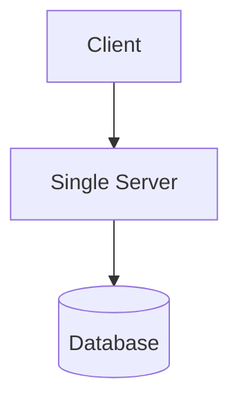
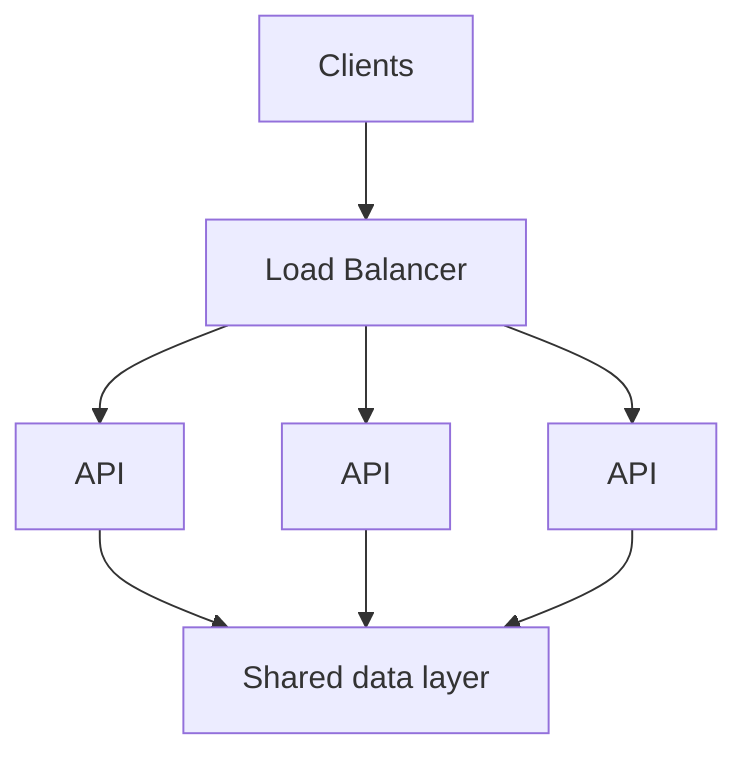

# Scalability & Capacity

Scalability описывает, как система сохраняет приемлемое поведение при росте числа пользователей, трафика, данных или работы. Capacity planning помогает оценить, когда ресурс достигнет предела. Его задача - заранее найти вероятные ограничения, а не предсказать каждое число с абсолютной точностью.

## Описание нагрузки

**RPS (Requests Per Second)** показывает частоту запросов, но это лишь одно измерение. Учитывайте также число одновременных пользователей или соединений, размер payload, рост хранилища, тяжёлые для CPU операции и квоты внешних систем. Read-heavy каталог и write-heavy поток телеметрии могут иметь одинаковый RPS, но разные bottlenecks.

Latency и throughput связаны, но не взаимозаменяемы. Рост параллелизма может увеличивать throughput до насыщения ресурса, после чего очереди растут, а latency резко повышается. Backpressure ограничивает или отклоняет новую работу, чтобы перегруженная зависимость восстановилась, а backlog не рос бесконечно.

## Приблизительная оценка capacity

Для оценки порядка величины:

```text
1 000 000 активных пользователей в день
10 значимых запросов на пользователя в день
= 10 000 000 запросов в день
≈ 116 запросов в секунду в среднем
```

Среднее значение не является целевой capacity. Пики, часовые пояса, запуски кампаний, retries, всплески и дорогие endpoints могут многократно увеличить нагрузку. Оценивайте пиковые чтения и записи отдельно, фиксируйте запас, измеряйте production-поведение и обновляйте модель.

## Способы масштабирования

**Вертикальное масштабирование** добавляет одному узлу CPU, память или I/O capacity. Оно проще, но ограничено возможностями оборудования и одним failure domain. **Горизонтальное масштабирование** добавляет узлы и может повысить capacity и redundancy, но требует маршрутизации, координации, развёртывания и observability нескольких экземпляров.

Stateless services хранят долговечное состояние запросов вне процесса, поэтому load balancer может направлять запросы взаимозаменяемым экземплярам. Stateful components владеют данными или сессиями и обычно требуют replication, partitioning или явного переноса состояния.



может развиться в:



Load balancer распределяет работу, но не устраняет bottleneck базы данных. Replication может добавить capacity чтения и redundancy, а partitioning разделяет данные и нагрузку записи. Оба подхода усложняют consistency, маршрутизацию, rebalancing и обработку отказов.

## Hotspots и bottlenecks

У системы может оставаться свободная общая capacity, но один hot partition, популярный cache key, tenant, регион или lock всё равно вызовет отказ. Измеряйте utilization, глубину очередей, перцентили latency, error rate и saturation вдоль критического пути. Средние значения могут скрывать небольшую группу очень медленных запросов.

Масштабируйте ограниченный ресурс и проверяйте, что стало следующим ограничением. Возможные меры: оптимизация access patterns, кэширование подходящих чтений, пакетная запись, partitioning данных, ограничение параллелизма или перенос медленной работы из request path.

Горизонтальное масштабирование повышает операционную сложность, stateful components сложнее распределять, а распределённая координация создаёт новые сценарии отказа. Многим продуктам достаточно простой системы с измеренным запасом. Масштабирование должно опираться на требования и наблюдения, а не на предположение, что любая система обязана быть огромной.

## См. также

- [Основы System Design](fundamentals.ru.md)
- [Data Storage & Consistency](data-storage-consistency.ru.md)
- [Caching & Data Freshness](caching.ru.md)
- [Reliability & Failure Handling](reliability.ru.md)
