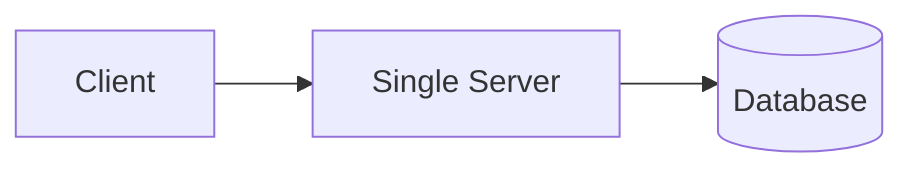
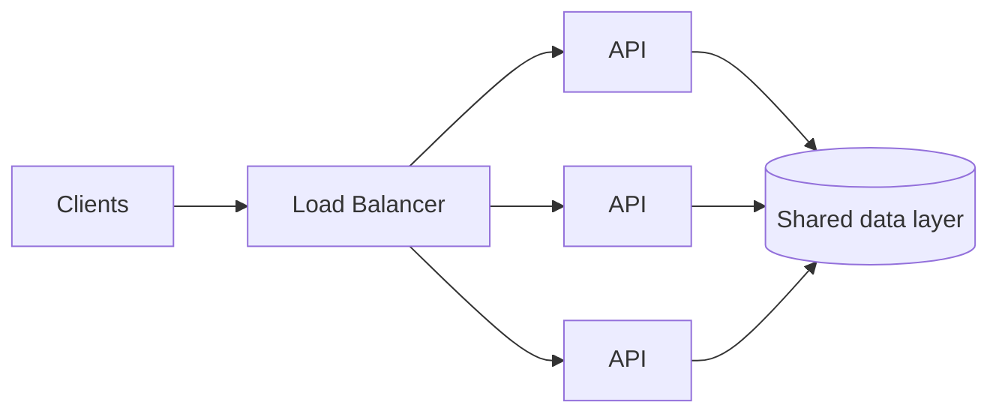

# Scalability & Capacity

Scalability описывает, как система сохраняет приемлемое поведение при росте числа пользователей, трафика, данных или работы. Capacity planning помогает оценить, когда ресурс достигнет предела. Задача - найти вероятные ограничения и сохранить достаточный запас, а не предсказать каждое число с абсолютной точностью.

## Описание нагрузки

**RPS (requests per second)** показывает частоту запросов, но это лишь одно измерение. Учитывайте также:

- число одновременных запросов и долгоживущих соединений;
- соотношение чтений и записей, а также дорогие типы запросов;
- размер payload и пропускную способность сети;
- CPU, память, disk I/O и квоты внешних систем;
- объём данных, срок хранения и скорость роста.

Read-heavy каталог и write-heavy поток телеметрии могут иметь одинаковый RPS, но разные bottlenecks. Используйте профиль нагрузки, а не одно глобальное число.

**Throughput** - число завершённых операций за единицу времени. **Concurrency** - объём работы, выполняемой одновременно. Для стабильной системы полезна приблизительная оценка:

```text
одновременные запросы ≈ запросы в секунду × среднее время в системе
500 RPS × 0,2 с ≈ 100 одновременных запросов
```

Latency и throughput связаны, но не взаимозаменяемы. Рост concurrency может увеличивать throughput до насыщения ресурса. Когда скорость поступления работы превышает скорость обработки, очереди растут, tail latency повышается, timeout запускает retries, а дополнительные повторы могут усилить перегрузку. Backpressure, ограниченные очереди, rate limits и load shedding не дают backlog расти бесконечно.

## Приблизительная оценка capacity

Начните с оценки порядка величины и зафиксируйте предположения:

```text
1 000 000 активных пользователей в день
× 10 значимых запросов на пользователя в день
= 10 000 000 запросов в день
≈ 116 RPS в среднем

пиковый RPS ≈ средний RPS × коэффициент пика
116 × 8 ≈ 928 RPS
```

Коэффициент пика должен опираться на ожидания продукта или измеренный трафик - универсального значения нет. Оценивайте критические пути чтения и записи отдельно: стоимость endpoint и распределение трафика важнее одного среднего значения.

Для хранилища нужна отдельная оценка:

```text
рост хранилища ≈ записей в день × байт на запись × срок хранения × коэффициент репликации
```

Если это существенно, учитывайте индексы, метаданные, backups, сжатие и временное место для миграций. Для каждой оценки фиксируйте ожидаемый пик, запас и ресурс или квоту, которые вероятнее всего исчерпаются первыми.

Проверяйте модель production-метриками и нагрузочными тестами. Тестируйте репрезентативную нагрузку до момента, когда latency или ошибки станут неприемлемыми, а не только до высокого среднего CPU. Capacity должна покрывать пик и сценарии отказа: потеря одного instance, зоны, shard или квоты зависимости уменьшает доступную capacity именно тогда, когда нагрузка перераспределяется.

## Паттерны мобильной нагрузки

DAU и средний RPS могут скрывать всплески, вызванные клиентами:

- polling и периодическая фоновая работа могут совпадать по времени;
- после восстановления сети или сервиса множество клиентов может переподключиться одновременно;
- push-уведомление способно вызвать массовое обновление данных;
- retries могут многократно увеличить трафик во время сбоя;
- realtime-функции расходуют capacity соединений и память даже при низком RPS сообщений.

Клиенты должны по возможности избегать синхронной работы. Экспоненциальный backoff с jitter, ограниченное число retries, серверные подсказки о времени повтора, кэширование, дедупликация запросов и идемпотентные операции уменьшают retry storms. Серверу всё равно нужна защита: старые версии приложения и сторонние клиенты могут не соблюдать ожидаемое поведение.

## Способы масштабирования

**Вертикальное масштабирование** увеличивает ресурсы одного узла: CPU, память или I/O capacity. Оно операционно проще, но ограничено оборудованием, стоимостью и пределами одного failure domain.

**Горизонтальное масштабирование** добавляет узлы и может повысить capacity и redundancy, но требует маршрутизации, координации, развёртывания и observability нескольких экземпляров.

Stateless services хранят долговечное состояние запросов вне процесса, поэтому load balancer может направлять запросы взаимозаменяемым экземплярам. Stateful components владеют данными или сессиями и обычно требуют replication, partitioning или явного переноса состояния.



может развиться в:



Load balancer распределяет работу, но не устраняет bottleneck базы данных. Replication может добавить capacity чтения и redundancy, а partitioning разделяет данные и нагрузку записи. Оба подхода усложняют consistency, маршрутизацию, rebalancing и обработку отказов.

Autoscaling реагирует с задержкой: метрики должны измениться, новые ресурсы - запуститься, а нагрузка - перераспределиться. Сохраняйте минимальную capacity и запас для более быстрых всплесков. Масштабируйте по сигналу, близкому к bottleneck: CPU для compute-bound работы; глубине очереди, числу соединений, latency или собственным единицам работы в других случаях. Задавайте явные пределы и проверяйте квоты.

## Hotspots и bottlenecks

У системы может оставаться свободная общая capacity, но один hot partition, популярный cache key, tenant, регион или lock всё равно вызовет отказ. Измеряйте utilization, saturation, глубину очередей, перцентили latency, error rate, профиль трафика и отклонённую работу вдоль критического пути. Средние значения могут скрывать небольшую группу очень медленных запросов или перегруженный shard.

Масштабируйте ограниченный ресурс, затем проверяйте следующее ограничение. Возможные меры: оптимизация access patterns, кэширование подходящих чтений, пакетная запись, partitioning данных, ограничение concurrency или перенос медленной работы из request path.

Capacity балансирует reliability и стоимость. Многим продуктам достаточно простой системы с измеренным запасом. Масштабируйте, когда это подтверждают требования и наблюдения.

## См. также

1. [Основы System Design](fundamentals.ru.md)
2. [Data Storage & Consistency](data-storage-consistency.ru.md)
3. [Caching & Data Freshness](caching.ru.md)
4. [Reliability & Failure Handling](reliability.ru.md)
